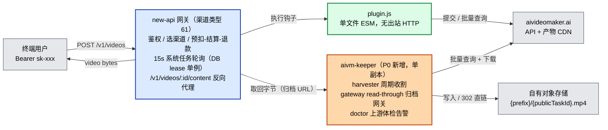
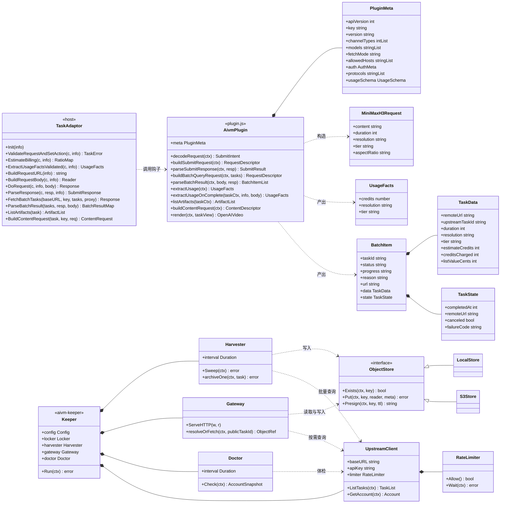
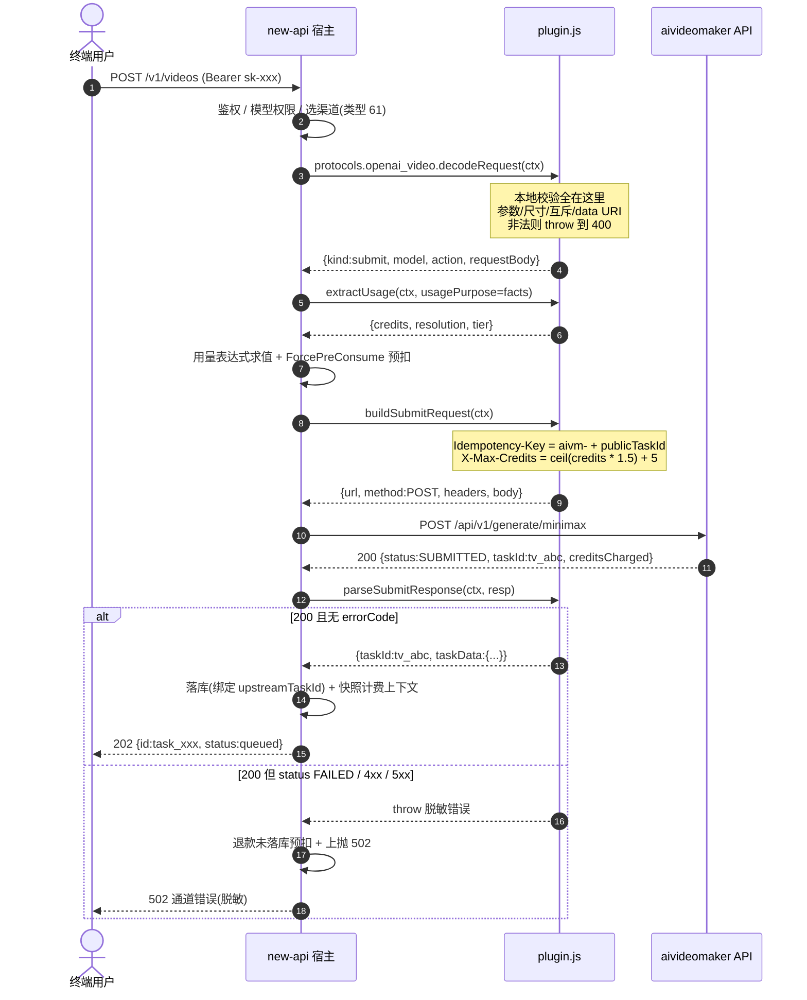
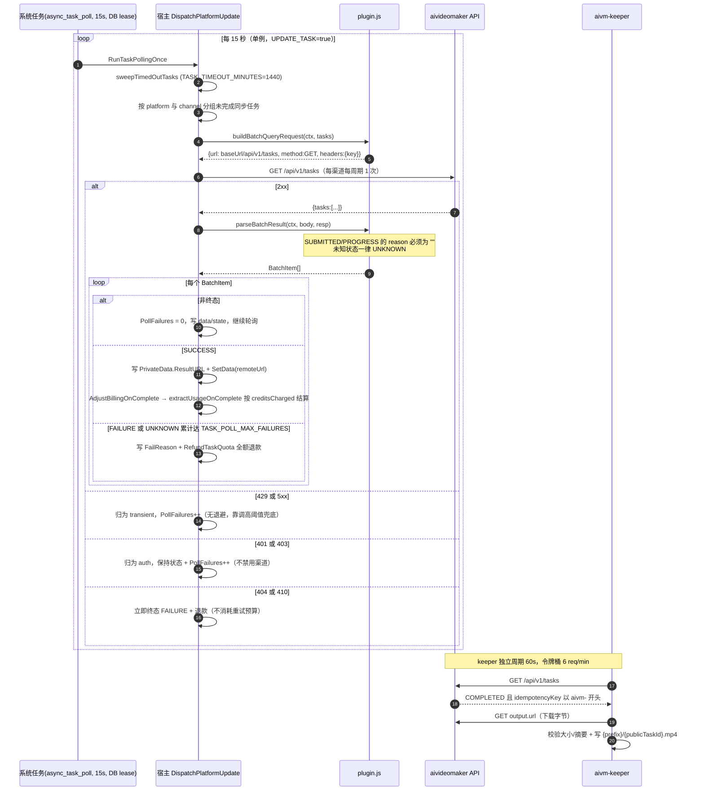
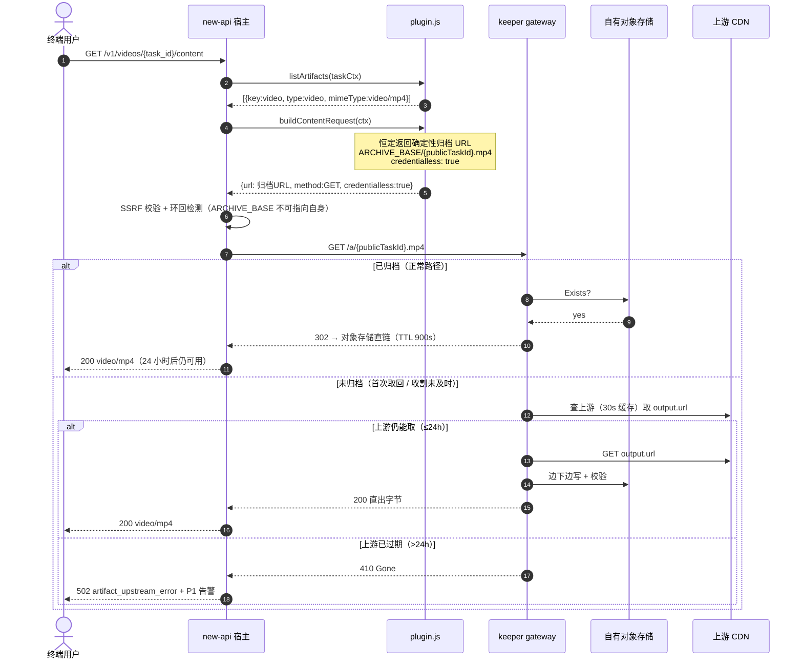
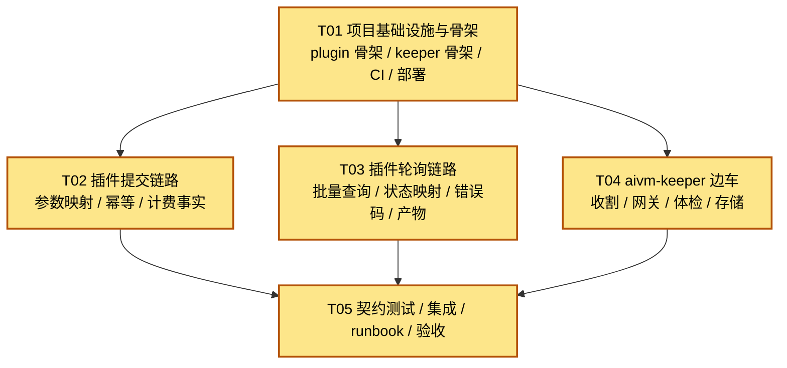

# 系统设计 — AIVideoMaker 反向代理通道 (MiniMax H3)

| 项 | 值 |
|---|---|
| 文档版本 | v1.0 |
| 撰写人 | 高见远（Gao）· Architect |
| 阶段 | Phase 2 — 系统设计 + 任务分解 |
| 上游输入 | `docs/prd/prd-aivideomaker.md`（v1.0，许清楚）、`docs/upstream/api-research.md`、`docs/upstream/aivideo-openapi.json` |
| 源码验证基线 | `QuantumNous/new-api` @ `main`（最新 tag `v1.0.0-rc.36`，2026-09-08） |
| 目标读者 | 寇豆码（工程师，Phase 3）、严过关（QA，Phase 4）、齐活林（主理人，决策门） |
| 语言 | 中文 |

---

## 0. 先读这一节：四个会改变实现的源码结论

本设计**不依赖官方文档推断**，全部结论来自 `QuantumNous/new-api` 主线源码逐行核对（用 `gh api ... --jq .content \| base64 -d` 单文件读取，未 clone）。以下四条推翻或修正了 PRD 的若干假设，请工程师与 QA 优先阅读。

### 0.1 Q-1 结论：**否 — 宿主不持久化媒体**（R-07 因此无法由宿主交付）

三条互相独立的证据：

**证据 1 — 进程级存储后端恒为「禁用实现」**（`service/task_artifact_store.go`）

```go
var taskArtifactStore TaskArtifactStore = &disabledArtifactStore{}

// GetTaskArtifactStore returns the process-wide artifact storage backend. This
// release always returns the disabled implementation.
func GetTaskArtifactStore() TaskArtifactStore { return taskArtifactStore }

func (disabledArtifactStore) Persist(context.Context, *model.Task, types.TaskArtifact, io.Reader) (*StoredArtifactRef, error) {
    return nil, ErrTaskArtifactStoreDisabled
}
```

**证据 2 — S3 模式被显式降级为上游代理**（`setting/system_setting/task_artifact_store.go`）

```go
if config.Mode == TaskArtifactStoreModeS3 {
    common.SysError("task artifact S3 storage is not implemented; using upstream mode")
    config.Mode = TaskArtifactStoreModeUpstream
}
```
`TASK_ARTIFACT_STORE_MODE` / `TASK_ARTIFACT_STORE_S3_*` 等环境变量**已预留但未实现**；`LoadTaskArtifactStoreConfig` 注释：`S3 mode is deliberately disabled until a storage implementation is shipped.`

**证据 3 — 取回路径是实时反向代理，字节不落盘**（`controller/task.go:329` + `controller/video_proxy.go:291`）

```go
artifactStore := service.GetTaskArtifactStore()
if ref, resolveErr := artifactStore.Resolve(task, artifactKey); resolveErr == nil && ref != nil {
    _ = artifactStore.Serve(c, task, ref)   // 恒不进入：Resolve 返回 (nil, nil)
    return
}
// ...
if _, err := io.Copy(c.Writer, resp.Body); err != nil {   // 直接流式转发给用户
```

**结论**：new-api 宿主的 `artifact` / `content` 钩子**只提供一条长期有效的取回「句柄」**（`/v1/tasks/{task_id}/artifacts/{key}/content?access=<HMAC>`，HMAC 无过期时间，见 `service/task_artifact_access.go`），但**字节始终实时从上游 URL 拉取**。上游保留 24 小时 ⇒ **所有视频 24 小时后必然失效**。

> **对 P0 交付物数量的影响（PRD §7.2 Q-1 所问）**：P0 **必须**追加一个独立进程（本设计称 `aivm-keeper`）。PRD 术语表中的「harvester 边车」假设成立。

### 0.2 插件**没有出站 HTTP 能力** ⇒ `quote` / `account` 端点无法在插件内调用

- `pkg/jsplugin/utils.go` 的 `injectGlobals` 只注入 `utils`（`unixNow` / `jwtSignHS256` / `hmacSHA256` / `base64` / `base64URL` / `base64URLDecode` / `uuid` / `volcSignV4`）与 `console.log`。**没有 `fetch`，没有 `XMLHttpRequest`，没有 `require`。**
- `pkg/jsplugin/engine.go:102` 用正则禁止 `async` / `await` / `import`。
- 提交链路（`relay/channel/task/jsplugin/adaptor.go`）对上游**只发一个请求**：`ValidateRequestAndSetAction` → `buildSubmit` → `BuildRequestURL/Header/Body` → `DoRequest` → `channel.DoTaskApiRequest` → `ParseResponse`。不存在「先发 A 再发 B」的编排位。

**后果（两处 PRD 修正）**：

| PRD 条目 | 原假设 | 源码事实 | 本设计的处理 |
|---|---|---|---|
| R-03（权威报价） | 插件提交前调 `POST /api/v1/quote/minimax` | **做不到** | 改为「内嵌价目表本地估算 `credits` + `X-Max-Credits` 兜底上界 + 完成时按权威 `creditsCharged` 结算」。**Q-4 因此不是权衡题，而是能力约束**——见 §2.4 |
| R-10（`GET /api/v1/account` 渠道体检） | 插件实现渠道测试 | **做不到**（`pkg/jsplugin` 无健康检查钩子） | 迁移到 `aivm-keeper` 的 `doctor` 模块 |

### 0.3 轮询**已被宿主单例化**，但**没有退避**

- `main.go:151-157` 注释：`... scheduled system tasks (DB-lease dedup across masters + run history) ... Master-only execution and the UpdateTask switch are enforced inside the runner and each handler's Enabled().`
- `controller/system_task_handlers.go:138-153`：`asyncTaskPollHandler`，`Interval() = 15 * time.Second`，`Enabled() = constant.UpdateTask && model.HasUnfinishedSyncTasks()`。
- `service/system_task.go:305-329`：`runWithLeaseHeartbeat` 用 DB 锁 + 心跳续租；TTL 是崩溃检测窗口。
- `service/task_polling.go:226-282`：`UpdateBatchTasks` 按渠道分组，**每个渠道每周期只发一次 `FetchBatchTasks`** ⇒ 天然 O(1)，PRD R-06.1 成立。

**但 `service/task_polling.go:710-725` 的 `classifyPollHTTP` 把 429/5xx 一律归为 `pollClassTransient`，宿主不做指数退避、不读 `Retry-After`，只做 `PollFailures++`**；`constant/env.go:21` + `common/init.go:205` 默认 `TASK_POLL_MAX_FAILURES = 20`。
⇒ **连续 20 次 × 15 秒 = 5 分钟**的 429 就会把该渠道**全部在飞任务强制 FAILURE 并退款**。这是本设计的头号运维风险，§2.5 给出参数与容量对策。

### 0.4 两个会让工程师踩坑的宿主行为

1. **批量模式下，非终态结果里任何非空 `reason` 会被强制判失败**（`service/task_polling.go:344-348`）：
   ```go
   if responseItem.TaskInfo.Reason != "" || task.Status == model.TaskStatusFailure {
       task.Status = model.TaskStatusFailure
       task.Progress = "100%"
   }
   ```
   ⇒ `parseBatchResult` 对 `SUBMITTED` / `PROGRESS` **必须返回 `reason: ""`**。只有 `FAILED` / `CANCEL` / `UNKNOWN` 才可带 reason。

2. **`allowedHosts` 是精确 host 匹配，不支持通配符**（`pkg/jsplugin/request.go` 的 `ValidateRequestURL` 用 `canonicalHost` 逐个等值比对）。**但 `credentialless: true` 的内容请求会完全绕过 `allowedHosts` 校验**（`adaptor.go:891-904` 的 if/else 分支）。
   ⇒ 修正 PRD §6.3：产物 CDN 域**不必**写进 `allowedHosts`（我们走 credentialless）；需要放行的是**宿主与 keeper 的出网策略**。若 Q-7 查出 CDN 使用按任务随机子域，则**必须**走 credentialless，否则 `allowedHosts` 无法表达。

---

## Part A · 系统设计

## 1. 实现方案与框架选型

### 1.1 形态结论：**C（new-api Task Plugin，渠道类型 61）**

**源码证据**

| 断言 | 证据 |
|---|---|
| 渠道类型 61 存在 | `constant/channel.go:61` — `ChannelTypeTaskPlugin = 61`（同文件还有 `ChannelTypeKling = 50`） |
| 宿主内置 OpenAI 视频协议路由 | `pkg/jsplugin/routing.go:86-90`：<br>`create` → `POST /v1/videos`（需 `decodeRequest`）<br>`retrieve` → `GET /v1/videos/:task_id`（需 `render`）<br>`content` → `GET|HEAD /v1/videos/:task_id/content`（需 `listArtifacts` + `buildContentRequest`） |
| 官方现役视频插件即用此机制 | `plugins/tasks/{kling,jimeng,vidu,hailuo,doubao,alibaba,google,sora,sunoapi,vertex-ai}/plugin.js` |
| 批量轮询位存在 | `pkg/jsplugin/registry.go:266-271`：`fetchMode === "batch"` 时强制要求 `buildBatchQueryRequest` + `parseBatchResult` |

**选型理由**（对照 PRD §4.2 决策矩阵）

- **排除 B（Fork）**：`v1.0.0-rc.32 → rc.36` 在 **4 天内**发布（2026-09-04 → 2026-09-08），且**至今没有任何 GA 版本**（最新 tag 仍是 `v1.0.0-rc.36`）。Fork 的 rebase 成本是**每日一次**，无上界。
- **排除 A（中间层 + Kling 伪装）**：A 相比 C 唯一的技术优势是「能做 `quote` 与 `account` 往返」（见 §0.2）。但 A 需要自建预扣/结算/退款链、自建轮询与失败计数、自建 `/v1/videos` 协议，且要伪装 Kling schema 导致 `tier`/`referenceAudioUrls` 等维度丢失。**用一整个服务的运维面去换两次 HTTP 往返，不划算。**
- **C 的净收益**：免费获得预扣-结算-退款链（`ForcePreConsume` + `AdjustBillingOnComplete` + `RefundTaskQuota`）、集中式轮询与失败计数（`PollFailures` / `TASK_POLL_MAX_FAILURES` / 24h 超时扫描 `TASK_TIMEOUT_MINUTES`）、OpenAI 视频协议钩子、渠道/密钥/分组/倍率管理。

**降级预案仍是 A**，但触发条件需要主理人重新评估——见 §3.1 决策门。

### 1.2 运行时与语言

| 组件 | 技术 | 说明 |
|---|---|---|
| 适配层 | **ESM JavaScript 单文件**（`plugin.js`） | 宿主硬约束：同步、无 `import`、无 `async/await`、无 `fetch`。由 `github.com/grafana/sobek` 引擎执行（Go 实现的 JS 运行时） |
| 边车 | **Go 1.24+** 单二进制 | 与 new-api 同栈，便于复用其类型约定；静态编译便于部署；`net/http` + `log/slog` 零第三方依赖即可跑通主干 |
| 对象存储 | 本地卷（默认）/ S3 兼容（可选） | 本地卷用 `os` 直接写；S3 用 `aws-sdk-go-v2`。两者抽象在同一 `store.ObjectStore` 接口后 |
| 测试 | `node:test`（插件）+ `go test`（keeper）+ Go 版 fake upstream | 三方共享同一 fake upstream 二进制，防契约漂移 |

**为什么不引入 Node/Python 写边车**：边车与 new-api 同机部署，Go 单二进制无运行时依赖，且能复用与 new-api 一致的 HTTP/超时/代理语义。

### 1.3 架构总览



**关键设计选择：产物取回交给「read-through 归档网关」而非「插件在 archive/upstream 之间猜」。**

`buildContentRequest` 恒定返回确定性的归档 URL `ARCHIVE_BASE/{publicTaskId}.mp4`（`credentialless: true`），由 `aivm-keeper` 的 gateway 模块处理：

- 对象已存在 → `302` 到对象存储直链（keeper 不占带宽）；
- 对象不存在 → keeper 用上游批量查询（≤30s 缓存）取 `output.url`，**边下边写**落盘后直出；
- 上游已过期（>24h）→ `410 Gone` + 告警（此时若对象已存在则不会走到这）。

这样**消灭了「归档是否已完成的竞态窗口」**——不再需要 PRD 设想的「5 分钟 grace 期 + 插件猜状态」。归档 URL 是纯函数 `f(publicTaskId)`，插件与 keeper 各自独立推导，**两者之间零通信、零回写**。

> ⚠️ **硬约束**：`ARCHIVE_BASE` 的 host **必须区别于 new-api 自身对外地址**。`controller/video_proxy.go` 的 `isSelfTaskMediaURL` / `isTaskMediaFallbackLoop` 会把指回自己的 URL 判定为代理环并以 502 拒绝。

### 1.4 框架/库选型理由

| 需求 | 选型 | 理由 |
|---|---|---|
| JS 运行时 | 宿主内置 `grafana/sobek` | 不可选。`pkg/jsplugin` 已固定 |
| HTTP 客户端（keeper） | 标准库 `net/http` | 需要精细控制 `Retry-After`、超时、Range；标准库足够，避免依赖膨胀 |
| 限速 | `golang.org/x/time/rate` | 令牌桶官方实现，语义清晰，支持 `Wait`/`Allow` |
| 对象存储 | `aws-sdk-go-v2`（`config` + `s3`） | 兼容 S3 的所有主流对象存储；本地卷走自研实现，同一接口 |
| 配置 | `gopkg.in/yaml.v3` + 环境变量覆盖 | 部署友好；环境变量便于 K8s/Docker 注入密钥 |
| 指标 | `prometheus/client_golang` | 运维已有 Prometheus 生态 |
| 日志 | 标准库 `log/slog` | 结构化 JSON 输出，与 §8.3 日志字段约定对齐 |
| 选主 | 接口抽象 `lead.Locker`，实现：K8s Lease / 本地文件锁 / 无（单副本） | 避免绑定编排系统 |

---

## 2. 关键机制设计（含 PRD 修正说明）

### 2.1 三段状态映射（PRD R-05，硬约束）

宿主权威常量（`model/task.go:36-44`）与 `ToVideoStatus()`（`model/task.go:19-34`）：

```go
TaskStatusNotStart / SUBMITTED / QUEUED / IN_PROGRESS / FAILURE / SUCCESS / UNKNOWN
// ToVideoStatus:  NOT_START|QUEUED|SUBMITTED → queued
//                 IN_PROGRESS → in_progress
//                 SUCCESS → completed
//                 FAILURE → failed
//                 default（含 UNKNOWN）→ unknown
```

**映射表（插件 `parseBatchResult` 的返回值契约）**

| 上游 `status` | new-api `TaskStatus` | OpenAI `status` | `progress` | `reason` | `state` 追加 | 宿主后续动作 |
|---|---|---|---|---|---|---|
| `SUBMITTED` | `SUBMITTED` | `queued` | `"0%"` | **必须 `""`** | — | `PollFailures=0`，继续轮询 |
| `PROGRESS` | `IN_PROGRESS` | `in_progress` | 上游无进度则 `"50%"` | **必须 `""`** | — | `PollFailures=0`，继续轮询 |
| `COMPLETED` | `SUCCESS` | `completed` | `"100%"` | `""` | `{remoteUrl, completedAt, creditsCharged, listValueCents}` | 结算、停止轮询、暴露 artifact |
| `FAILED` | `FAILURE` | `failed` | `"100%"` | 脱敏原因（如 `upstream task failed`） | `{failureCode}` | **退款** |
| `CANCEL` | `FAILURE` | `failed` | `"100%"` | `upstream task was cancelled` | `{canceled: true}` | **退款**，审计可区分 |
| 其他 / 缺失 / 非字符串 | **`UNKNOWN`** | `unknown` | 不变 | 诊断文本（仅进 WARN 日志） | — | 宿主判 `pollClassUnrecognized`，`PollFailures++`；**不会**伪装成 in_progress |

**严禁兜底成 `IN_PROGRESS`。** PRD §10 给工程师的警告在源码层面得到印证：

```go
// service/task_polling.go:318
if parsedStatus == model.TaskStatusUnknown || parsedStatus == "" || !knownPollStatus(parsedStatus) {
    ... recordPollFailure(ctx, adaptor, task, snap.Status, pollClassUnrecognized, ...)
    continue
}
```
`knownPollStatus`（`service/task_polling.go:727-734`）只接受 6 个非 UNKNOWN 状态；`UNKNOWN` 会走 `unrecognized` 分支并有界累加失败计数，20 次（可调）后 FAILURE + 退款。**这正是我们想要的行为**——失败会暴露，而不是假装运行到 24h 超时。

### 2.2 幂等键治理（PRD R-04）

```
Idempotency-Key = "aivm-" + publicTaskId
```

- `ctx.publicTaskId` 由宿主在 `submitContext` 注入（`adaptor.go:1276`），是 new-api 公开任务 ID，稳定且非时间戳。
- 长度：`"aivm-"`(5) + 公开 ID（PRD 示例 `task_9f2b7c1e` = 13）≈ 18 字符，落在上游 8–128 约束内。生成前做长度断言，越界则退化为 `utils.uuid()`（36 字符，同样合法）并**打 WARN 日志**（属内部缺陷级信号）。
- 重试同一逻辑生成时 `publicTaskId` 不变 ⇒ Key 不变 ⇒ 上游返回原 `taskId`，不二次扣费。
- 上游响应 `idempotentReplay: true` 时：插件**照常返回该 `taskId`**，不新建、不改计费；仅记 `INFO` 日志与指标 `idempotent_replay_total`。
- 上游 `409 IDEMPOTENCY_CONFLICT`：记为**内部缺陷级告警**（`aivm_idempotency_conflict_total`）。**不在提交层换新 Key 重试**——重试会生成新 `publicTaskId`，从而产生新的上游任务与新的扣费（PRD R-04.5 的「换新 Key 重试一次」在方案 C 下会破坏「不重复扣费」硬指标）。直接上抛 + 退款 + 告警。

> ⚠️ **PRD R-04.5 修正**：在方案 C 下「换新 Key 重试」不可实现且有害。理由：宿主重试会分配新的 `publicTaskId`，幂等键随之改变，上游无从识别为同一逻辑生成。

**附带收益（架构级）**：上游 `Task` 对象回传 `idempotencyKey` 字段（PRD §6.4 ④）。`aivm-keeper` 因此**无需访问 new-api 的数据库或 API**，仅凭上游批量查询即可反解 `publicTaskId = idempotencyKey.slice(5)`，完成「上游任务 → 归档对象名」的映射。这是 §1.3 零通信设计的基石。

### 2.3 批量轮询（PRD R-06）

- `meta.fetchMode = "batch"`，实现 `buildBatchQueryRequest` + `parseBatchResult`。
- 宿主按**渠道**分组，每周期（15s）每渠道**一次** `GET {baseUrl}/api/v1/tasks`。
  ⇒ 单 key 每周期 1 次请求 = **4 req/min**，占 60 req/min/IP 预算的 6.7%。
- `buildBatchQueryRequest` 只返回：
  ```js
  { url: baseUrl + "/api/v1/tasks", method: "GET", headers: { key: ctx.apiKey, Accept: "application/json" } }
  ```
  不携带任何 per-task 参数（上游批量端点按 key 返回全部任务）。
- 单任务兜底 `buildQueryRequest` / `parseTaskResult` **仍然实现**（宿主在 `fetchMode !== "batch"` 时会要求它们；且 Q-2 若查出批量端点分页覆盖不足，可一键切回 per_task 而无需改代码）。

**上游限流治理（宿主做不到，只能靠容量与参数）**

| 层 | 手段 |
|---|---|
| 降低请求量 | 批量模式 4 req/min/channel；keeper 查询 1 req/min/key（60s 周期，且 30s 内复用缓存） |
| 提高失败容忍 | `TASK_POLL_MAX_FAILURES=120`（≈30 分钟）而非默认 20（5 分钟） |
| 超时兜底 | `TASK_TIMEOUT_MINUTES=1440`（默认，24h）保持 |
| 容量约束 | **单个上游 key 最多绑定一个渠道**；多 key 池化（R-17，P1）时每 key 独立计算预算 |
| 可观测 | 每次轮询记录 `aivm_poll_requests_total` / `aivm_poll_http_429_total`；429 占比 > 0.5% 触发告警（PRD §8.2） |

> ⚠️ **部署硬要求**：`UPDATE_TASK=true`。`asyncTaskPollHandler.Enabled()` = `constant.UpdateTask && model.HasUnfinishedSyncTasks()`。若为 `false`，轮询完全不启动，所有任务会停在 `SUBMITTED` 直到 24h 超时扫描判失败——且**超时扫描 `sweepTimedOutTasks` 也在 `RunTaskPollingOnce` 内**（`service/task_polling.go:145`），同样不会执行。

**R-06.7（401/403 不禁用渠道）**：宿主已原生满足——`classifyPollHTTP` 把 401/403 归为 `pollClassAuth`，只做 `recordPollFailureForTasks`（保持状态 + 计数），**不会**改渠道健康度。插件侧无额外工作，只需保证 `parseBatchResult` 在这些状态码下不被调用（宿主已跳过）。

### 2.4 计费（PRD R-03 / R-09），含 Q-4 结论

**Q-4 结论：省掉 `quote` 不是优化，是唯一可行路径。**

PRD §7.2 Q-4 问「能否省掉 quote 往返」。源码核查后的答案是：**方案 C 下根本没有发 quote 的位置**（§0.2）。因此权衡题变成了「补偿措施是否足够」。

**收益**：提交链路从 2 次上游往返降为 1 次，p95 目标（PRD §8.1）从 ≤2000ms 收紧到 ≤1200ms 成为可能。
**风险**：本地价目表与上游实际报价漂移 ⇒ `X-Max-Credits` 给低了会被 422 拒，给高了失去护栏意义；且预扣金额可能偏离结算金额。

**补偿设计（四条，缺一不可）**

1. **价目表内嵌 + 单一真源**：`PRICE_CREDITS_PER_SECOND` 常量表按 PRD §5 R-09 的 4 档写入（720p/turbo 3、720p/base 4、1080p/turbo 4、1080p/base 5），`credits = rate × duration`。**只用于预扣估算与 `X-Max-Credits` 下界，绝不用于最终结算。**
2. **`X-Max-Credits` 取宽松上界**：`maxCredits = ceil(estimate × 1.5) + 5`。理由：估算法本身只有 4 档且是精确乘法，漂移只可能来自上游调价；1.5 倍足以吸收一次常规调价，同时仍能拦住「参数被解析成 20 秒 × 1080p」这类量级错误。
3. **完成时以权威值结算**：`extractUsageOnComplete` 返回 `{ credits: creditsCharged - creditsRefunded }`（上游权威），宿主按提交时刻 `TaskBillingContext` 快照计算差额并补扣/退还。⇒ 预扣偏差**自动收敛**，用户最终只付真实消耗。
4. **漂移可观测**：`parseBatchResult` 在 `data` 中同时落 `estimateCredits` 与 `creditsCharged`、`listValueCents`；keeper 的 doctor 与日志按 PRD R-09.5 做 >1% 漂移告警。

**不做「422 后提额重试」**：宿主重试会分配新 `publicTaskId` ⇒ 新幂等键 ⇒ 新上游任务 ⇒ **重复扣费**，直接击穿 PRD §8.3 的「幂等失效导致的重复扣费 = 0 笔」硬指标。改为：422 一律上抛 + 退款 + P2 告警。

**用量事实（usage facts）契约**

```js
usageSchema: {
  credits:    { type: "number", unit: "credit", description: {...} },
  resolution: { type: "string", enum: ["720p", "1080p"], ... },
  tier:       { type: "string", enum: ["turbo", "base"], ... },
}
```

- **只暴露一个数值事实 `credits`**。宿主 `validatedUsageRatios`（`adaptor.go:1361-1396`）会把**每一个正数数值事实**当作乘法因子；同时暴露 `seconds` 和 `credits` 会导致重复计价。`resolution` / `tier` 声明为 enum ⇒ 返回 0、**不进 ratios**，只作分档与审计可见性（对应 PRD R-09.4「不需要为 4 种组合各建模型名」）。
- `extractUsage` 在 `usagePurpose === "billing_ratios"` 时返回 `null`（对齐官方 `plugins/tasks/kling/plugin.js:267`），在 `"facts"` 时返回完整事实向量。宿主存在两条计费路径：legacy `OtherRatios` 乘法器（`EstimateBilling`）与 `billingexpr` 用量表达式（`ExtractUsageFacts`）。本插件走后者。

> ❓ **待 Phase 3 与运维/PM 对齐**：模型侧的用量表达式具体写法（目标语义 `quota = credits × 0.01 USD × 倍率`）与 `QuotaPerUSD`（PRD Q-5，默认 1 USD = 500,000 quota）尚未由运维确认。这两项直接决定最终扣费金额，必须先用一次真实任务核对预扣金额与 `creditsCharged` 的一致性，再放开给用户。

### 2.5 终态产物持久化（PRD R-07）—— 由 `aivm-keeper` 承担

| 验收项 | 承担者 | 机制 |
|---|---|---|
| R-07.1 ≤5 分钟内落盘 | keeper `harvester` | 60s 周期扫上游 `GET /api/v1/tasks`，COMPLETED 且未归档 ⇒ 立即下载 |
| R-07.2 24h 后可取回 | keeper `gateway` + 对象存储 | 归档 URL `ARCHIVE_BASE/{publicTaskId}.mp4`；命中即 302 到存储直链 |
| R-07.3 落盘失败有界重试 + 告警 | keeper `harvester` | 指数退避 1s→2s→4s→…→5min，最多 8 次；耗尽写 `.missing` 标记 + P1 告警 |
| R-07.4 内容校验 | keeper `harvester` | 比对 `Content-Length`；可选 SHA-256；写入 sidecar `{key}.meta.json` |
| R-07.5 上游裸 URL 不是唯一路径 | 插件 | `buildContentRequest` 恒定返回归档 URL，永不直接返回上游 URL |

**keeper 组件职责**

| 模块 | 周期 | 行为 |
|---|---|---|
| `harvester` | 60s | `GET /api/v1/tasks`（1 req/min）→ 过滤 `status=COMPLETED && idempotencyKey.startsWith("aivm-")` → 未归档则下载落盘 |
| `gateway` | 按需 | `GET {ARCHIVE_BASE}/{publicTaskId}.mp4`：命中→302 存储直链；未命中→查上游（30s 缓存）→ 边下边写 → 直出；上游已过期→410 + 告警 |
| `doctor` | 300s | `GET /api/v1/account`（非计费）→ 余额/有效性 → 低于阈值（`最贵单次 × 10` = 100 credits）告警 |
| `lead` | — | 单副本保证：K8s Lease / 文件锁 / 显式单副本。多副本同时收割只浪费带宽，但**必须单副本**才能共享令牌桶预算 |
| `limiter` | — | 上游查询令牌桶 6 req/min（keeper 1 + 为 gateway 缓存未命中预留 5），与宿主的 4 req/min 合计 ≈ 10 req/min，占 60 的 17% |

### 2.6 错误码分级映射（PRD R-08）

**提交阶段**：宿主对 `parseSubmitResponse` 抛出的**任何**异常一律返回 **502**（`adaptor.go:464`：`"plugin_submit_response_failed", http.StatusBadGateway`）。因此：

> **设计规则**：一切**可预判的用户错误必须在 `protocols.openai_video.decodeRequest` 里抛出**（宿主映射为 `plugin_request_invalid` → **400**，见 `adaptor.go:102`）。`parseSubmitResponse` 只允许表达「上游/配置/内部」类错误（502）。

| 上游 | HTTP | 判定位置 | 对用户的状态码 | 退款 | 重试 | 告警 |
|---|---|---|---|---|---|---|
| 参数/尺寸非法、首末帧与参考素材互斥、data URI 违规 | —（本地拦截） | `decodeRequest` | **400** | 是（未预扣） | 否 | 否 |
| 内容审核拒绝 | 422 | `parseSubmitResponse` | 502（脱敏后上抛） | 是 | 否 | 记录供审计 |
| `AUTH_FAILED` | 401 | `parseSubmitResponse` | 502 | 是 | 否 | **P1**（渠道配置错） |
| `INSUFFICIENT_CREDITS` | 402 | `parseSubmitResponse` | 502 | 是 | 否 | **P1 + 充值提醒** |
| `BUDGET_EXCEEDED` | 422 | `parseSubmitResponse` | 502 | 是 | **否**（见 §2.4） | P2 |
| `IDEMPOTENCY_CONFLICT` | 409 | `parseSubmitResponse` | 502 | 是 | **否**（见 §2.2） | P2（内部缺陷级） |
| `RATE_LIMITED` | 429 | `parseSubmitResponse` | 502 | 是 | 由宿主换渠道 | 频度超阈值才告警 |
| 未知 `errorCode` | 任意 | `parseSubmitResponse` | 502 | 是 | 否 | **是**（默认分支，不得静默吞） |

**HTTP 200 但业务失败**（`{status:"FAILED", errorCode:"..."}`）：`parseSubmitResponse` 必须检查响应体 `status` 与 `errorCode`，**不得**仅凭 HTTP 200 判成功（PRD R-08.3）。

**脱敏**：错误消息统一过 `redact()` —— 移除上游 key、`tv_` 前缀任务号、内部 URL、query string，截断 200 字符后上抛。宿主侧另有 `redactVideoResponseBody`（`service/task_polling.go:760`）兜底。

### 2.7 参数映射与前置校验（PRD R-02）

| OpenAI 字段 | 上游字段 | 规则 |
|---|---|---|
| `prompt` | `content` | 必填，trim 后非空；长度 > 0 |
| `seconds` | `duration` | 整数 5–20，缺省 5；非整数或越界 → 400 |
| `size` | `resolution` + `aspectRatio` | 见下表 |
| 模型名 | `tier` | `aivm-minimax-h3` → `turbo`；`aivm-minimax-h3-base` → `base` |

**`size` 推导表**（`min = Math.min(w, h)`）

| 条件 | `resolution` | 说明 |
|---|---|---|
| `min >= 1080` | `1080p` | |
| `720 <= min < 1080` | `720p` | |
| `min < 720` | — | **400**（上游不支持 480p 及以下） |

`aspectRatio` = 与 `w/h` 最接近的档位（`21:9` / `16:9` / `4:3` / `1:1` / `3:4` / `9:16`），相对误差 > 8% 时回落 `auto`。常见尺寸直查表先命中，避免浮点误差：

| `size` | `resolution` | `aspectRatio` |
|---|---|---|
| `1280x720` / `1792x1024` / `1920x1080` | `720p` / `720p` / `1080p` | `16:9` |
| `720x1280` / `1024x1792` / `1080x1920` | `720p` / `720p` / `1080p` | `9:16` |
| `1024x1024` | `720p` | `1:1` |

**互斥与数量校验骨架（P0 就位，即便功能走 P1）**

- `imageUrl` / `lastFrameUrl` 与 `referenceImageUrls` / `referenceVideoUrl` / `referenceAudioUrls` **互斥**。
- `referenceImageUrls ≤ 4`、`referenceAudioUrls ≤ 2`、`referenceVideoUrl ≤ 1`。
- 视频/音频字段拒绝 `data:` URI（上游只收公网 HTTP(S)）→ 400 并说明原因。
- 以上全部在 `decodeRequest` 内完成 ⇒ 用户拿到 400，且不产生任何上游往返、不预扣。

### 2.8 可观测性（PRD R-11）

宿主侧日志由 new-api 统一输出，插件通过 `console.log` 注入（宿主加 `[plugin:aivideomaker@<ver>]` 前缀，见 `engine.go:480`）。**统一字段集**（§8.3）保证任一 ID 可串起全链路。keeper 额外输出自己的结构化日志与 Prometheus 指标。

---

## Part B · 文件清单与任务分解

## 3. 文件清单（相对仓库根）

### 3.1 适配层（交付给 new-api 的唯一产物：单文件）

| 路径 | 说明 |
|---|---|
| `plugins/aivideomaker/plugin.js` | **全部插件逻辑**。单文件 ESM，无 `import`。含 `meta` + 11 个钩子 + 内部纯函数（全部 `export` 以便单测） |
| `plugins/aivideomaker/README.md` | 安装说明、渠道配置样例、`ARCHIVE_BASE` 与 keeper 的一致性要求、模型名与价格档位说明 |

> `meta` 关键字段：`apiVersion: 1`、`key: "aivideomaker"`、`channelTypes: [61]`、`models: ["aivm-minimax-h3","aivm-minimax-h3-base"]`、`fetchMode: "batch"`、`auth: {type:"api_key"}`（`resolveAuth` 会把渠道 key 注入 `ctx.apiKey`）、`protocols: ["openai_video"]`、`allowedHosts: []`（走 credentialless，无需声明；若未来改为带凭据取回再补）。

### 3.2 边车 `aivm-keeper`（Go）

| 路径 | 说明 |
|---|---|
| `keeper/go.mod` / `keeper/go.sum` | 模块定义 |
| `keeper/cmd/aivm-keeper/main.go` | 入口：加载配置 → 选主 → 启动 harvester / gateway / doctor / metrics |
| `keeper/internal/config/config.go` | 配置结构 + 环境变量覆盖 + 校验 |
| `keeper/internal/logging/logging.go` | `log/slog` JSON handler + 字段约定 |
| `keeper/internal/lead/lead.go` | `Locker` 接口 + `k8s` / `file` / `noop` 三种实现 |
| `keeper/internal/limiter/limiter.go` | 上游查询令牌桶（`golang.org/x/time/rate`） |
| `keeper/internal/upstream/client.go` | 上游 HTTP 客户端：`key` 头、超时、`Retry-After` 解析、错误分类 |
| `keeper/internal/upstream/model.go` | `Account` / `Task` / `TaskList` 等 DTO（对齐 `docs/upstream/aivideo-openapi.json`） |
| `keeper/internal/store/store.go` | `ObjectStore` 接口 |
| `keeper/internal/store/local.go` | 本地卷实现（默认） |
| `keeper/internal/store/s3.go` | S3 兼容实现（`aws-sdk-go-v2`） |
| `keeper/internal/harvest/harvester.go` | 周期收割 + 有界重试 + 内容校验 + `.meta.json` |
| `keeper/internal/gateway/gateway.go` | read-through 归档网关（302 / 边下边写 / 410） |
| `keeper/internal/doctor/doctor.go` | `/api/v1/account` 体检 + 余额告警 |
| `keeper/internal/metrics/metrics.go` | Prometheus 注册与指标定义 |

### 3.3 测试与部署

| 路径 | 说明 |
|---|---|
| `test/fakeupstream/main.go` | Go 版 fake aivideomaker server（可编排 200/400/401/402/409/422/429/5xx + 200-with-error-body + 大文件 + 慢速 chunk） |
| `test/fakeupstream/cases.go` | 用例编排表（PRD R-08 每行一例、R-05 每态一例） |
| `plugins/aivideomaker/test/mapping.test.mjs` | `size`→`resolution`/`aspectRatio` 穷举、duration 边界、互斥校验 |
| `plugins/aivideomaker/test/pricing.test.mjs` | 4 档价目、`X-Max-Credits` 计算、usage facts 形状 |
| `plugins/aivideomaker/test/idempotency.test.mjs` | 幂等键长度/稳定性、`idempotentReplay` 分支 |
| `plugins/aivideomaker/test/status-map.test.mjs` | 5 态 + UNKNOWN 分支 + 非终态 `reason=""` 断言 |
| `plugins/aivideomaker/test/batch-parse.test.mjs` | 批量解析、未知任务跳过、`data`/`state` 形状 |
| `plugins/aivideomaker/test/error-code.test.mjs` | 错误码矩阵（脱敏、终态、reason） |
| `plugins/aivideomaker/test/artifact.test.mjs` | `listArtifacts` / `buildContentRequest` 契约 |
| `keeper/internal/.../*_test.go` | keeper 各模块单元测试（fake upstream 通过 `httptest` 或复用 `test/fakeupstream`） |
| `test/integration/e2e_test.go` | 端到端：fake/真实上游 → 提交 → 轮询 → 归档 → 24h 后取回 |
| `Makefile` | `build` / `test` / `lint` / `fake-upstream` / `package-plugin` |
| `.github/workflows/ci.yml` | CI：**禁止静默跳过**（PRD R-12.6） |
| `deploy/docker-compose.yml` | new-api + keeper + 本地卷 |
| `deploy/keeper.env.example` | keeper 配置样例 |
| `docs/runbook/aivideomaker.md` | 上线手册：渠道配置、模型定价、`UPDATE_TASK=true`、`TASK_POLL_MAX_FAILURES=120`、CDN 出网放行、告警阈值 |
| `docs/architecture/aivideomaker-design.md` | 本文档 |
| `docs/architecture/class-diagram.mermaid` | 类图（已通过渲染器校验） |
| `docs/architecture/sequence-diagram.mermaid` | 提交时序图（已通过渲染器校验） |
| `docs/architecture/sequence-diagram-poll.mermaid` | 批量轮询时序图（已通过渲染器校验） |
| `docs/architecture/sequence-diagram-artifact.mermaid` | 产物取回时序图（已通过渲染器校验） |

## 4. 数据结构与接口

### 4.1 类图



### 4.2 插件钩子签名契约（JS，宿主侧 Go 结构体已核对）

```js
// —— 提交 ——
// ctx: { requestBody, requestHeaders, files, action, publicTaskId, originTaskId,
//        model, upstreamModel, baseUrl, apiKey, auth, authHeader, userSetting }
decodeRequest(ctx)        -> { kind: "submit", model, action, requestBody }
buildSubmitRequest(ctx)   -> { url, method, headers, body, action?, model?, rewriteModel? }
parseSubmitResponse(ctx, resp) -> { taskId, taskData?, immediate?, state? }
//        resp: { statusCode, headers, body }

// —— 轮询（fetchMode = "batch"）——
buildBatchQueryRequest(ctx, tasks) -> { url, method, headers }
//        ctx: { baseUrl, tasks[], apiKey, authHeader }
parseBatchResult(ctx, body, resp)  -> BatchItem[]
//        resp: { status, headers }

// —— 计费 ——
extractUsage(ctx)                       -> UsageFacts | null
extractUsageOnComplete(taskCtx, info, body) -> UsageFacts | null

// —— 产物 ——
listArtifacts(taskCtx)      -> [{ key, type, mimeType }]
//        taskCtx: { taskId, status, action, data, state, producerVersion }
buildContentRequest(ctx)    -> { url, method?, headers?, credentialless }
//        ctx: 上述 taskCtx + { upstreamTaskId, artifactKey, baseUrl, clientRequest, apiKey }

// —— OpenAI 视频协议 ——
protocols.openai_video.decodeRequest(ctx) -> { kind, model, action, requestBody }
protocols.openai_video.render(ctx, view)  -> OpenAIVideo
```

**宿主侧硬性返回值约束（`adaptor.go` + `service/task_polling.go` 核对）**

| 约束 | 来源 |
|---|---|
| `parseSubmitResponse.taskId` 非空 | `adaptor.go:472` |
| `parseSubmitResponse` 不得返回 `clientResponse` | `adaptor.go:467` |
| `decodeRequest` 不得返回 `renderer` | `adaptor.go:104` |
| artifact `key` 必须匹配 `^[A-Za-z0-9][A-Za-z0-9._~-]{0,127}$`，最多 64 个，type ∈ `video`/`audio`/`image`/`file` | `adaptor.go:74,76,1058-1113` |
| `taskData` / `state` 序列化后 ≤ 1 MiB，超出被丢弃并 WARN | `adaptor.go:79,506,663,737` |
| `buildContentRequest` 方法限于 GET/HEAD/POST；`credentialless` 时不得带 headers/body，URL 必须绝对 http(s) | `adaptor.go:888-901` |
| 非终态 BatchItem 的 `reason` 必须为 `""` | `service/task_polling.go:344` |

## 5. 程序调用流程

### 5.1 提交



### 5.2 批量轮询与终态处理



### 5.3 产物取回（突破 24 小时窗口）



## 6. 依赖包

### 6.1 适配层 `plugins/aivideomaker`

**运行时：零第三方依赖。** 宿主 `pkg/jsplugin` 已提供全部能力（`utils` / `console`）。插件中不得出现 `import`、`require`、`async`、`await`、`fetch`。

| 包 | 版本 | 用途 | 备注 |
|---|---|---|---|
| `node` | ≥ 22（配合 `node:test`） | 单元测试运行器 | 仅开发期；宿主的 JS 引擎是 Go 的 `sobek`，与 Node 版本无关 |

### 6.2 边车 `keeper`（Go）

| 包 | 版本 | 用途 |
|---|---|---|
| `go` | ≥ 1.24 | toolchain（`log/slog`、`net/http` 已足够跑通主干） |
| `golang.org/x/time` | `^0.9.0` | `rate` 令牌桶 |
| `gopkg.in/yaml.v3` | `^3.0.1` | 配置文件解析 |
| `github.com/prometheus/client_golang` | `^1.20.0` | 指标暴露 |
| `github.com/aws/aws-sdk-go-v2` | `^1.32.0` | S3 兼容存储客户端（可选路径） |
| `github.com/aws/aws-sdk-go-v2/config` | `^1.27.0` | 同上 |
| `github.com/aws/aws-sdk-go-v2/service/s3` | `^1.58.0` | 同上 |
| `k8s.io/client-go` | `^0.31.0` | K8s Lease 选主（可选构建标签 `k8s`） |

> ❓ 上述版本号为撰写时保守估计，最终以 `go get` 解析为准；`k8s.io/client-go` 建议用构建标签隔离，单机部署不必引入。

### 6.3 CI / 本地工具

| 工具 | 用途 |
|---|---|
| `golangci-lint` | Go 静态检查 |
| `node --test` | 插件单元测试 |
| `mermaid`（本仓库校验用） | `mermaid.parse()` + `mermaid.render()` 校验本文档图表 |

## 7. 任务列表（有序，含依赖）

> 分工原则：T01 是唯一的前置；T02 / T03 / T04 可**并行**；T05 收口。每个任务 ≥3 个文件。

### T01 · 项目基础设施与骨架（P0）

- **目标**：让插件能被 new-api 加载，让 keeper 能启动，CI 能跑通（先红后绿）。
- **源文件**：
  - `plugins/aivideomaker/plugin.js`（`meta` + 全部钩子的空实现，保证通过 `registry.go:266` 的必需钩子校验）
  - `plugins/aivideomaker/README.md`
  - `keeper/go.mod`、`keeper/go.sum`
  - `keeper/cmd/aivm-keeper/main.go`
  - `keeper/internal/config/config.go`
  - `keeper/internal/logging/logging.go`
  - `keeper/internal/lead/lead.go`
  - `keeper/internal/limiter/limiter.go`
  - `Makefile`
  - `.github/workflows/ci.yml`（含「禁止静默跳过」门禁）
  - `deploy/docker-compose.yml`、`deploy/keeper.env.example`
- **依赖**：无
- **优先级**：**P0**
- **验收**：`make build` 通过；CI 跑通；插件可被 `pkg/jsplugin` 编译并列出必需钩子；`aivm-keeper --help` 可运行。

### T02 · 插件提交链路：参数映射 / 幂等 / 计费事实（P0）

- **目标**：`POST /v1/videos` 端到端可用，本地校验、幂等键、用量事实全部就位。
- **源文件**：
  - `plugins/aivideomaker/plugin.js`（`protocols.openai_video.decodeRequest`、`buildSubmitRequest`、`parseSubmitResponse`、`extractUsage`，以及内嵌的映射表 / 价目表 / 幂等键 / 脱敏函数——**全部 `export` 以便单测**）
  - `plugins/aivideomaker/test/mapping.test.mjs`
  - `plugins/aivideomaker/test/pricing.test.mjs`
  - `plugins/aivideomaker/test/idempotency.test.mjs`
- **依赖**：T01
- **优先级**：**P0**
- **验收**：§2.7 `size` 推导表穷举通过；5 类本地非法输入均返回 400 且不产生上游调用；幂等键长度落在 8–128 且对同一 `publicTaskId` 稳定；`extractUsage` 在 `billing_ratios` 下返回 `null`、在 `facts` 下返回三字段。

### T03 · 插件轮询链路：批量查询 / 状态映射 / 错误码 / 产物（P0）

- **目标**：任务能从 `queued` 走到 `completed` 或 `failed`，产物句柄正确暴露。
- **源文件**：
  - `plugins/aivideomaker/plugin.js`（`buildBatchQueryRequest`、`parseBatchResult`、`extractUsageOnComplete`、`listArtifacts`、`buildContentRequest`、`protocols.openai_video.render`，以及单任务兜底 `buildQueryRequest` / `parseTaskResult`）
  - `plugins/aivideomaker/test/status-map.test.mjs`
  - `plugins/aivideomaker/test/batch-parse.test.mjs`
  - `plugins/aivideomaker/test/error-code.test.mjs`
  - `plugins/aivideomaker/test/artifact.test.mjs`
- **依赖**：T01
- **优先级**：**P0**
- **验收**：5 态 + UNKNOWN 全覆盖；**非终态 `reason` 必须为 `""`** 有专门断言；未知上游状态字符串断言映射为 `UNKNOWN`；`buildContentRequest` 恒定返回 `ARCHIVE_BASE/{publicTaskId}.mp4` 且 `credentialless: true`；`HTTP 200 + status FAILED` 被识别为业务失败。

### T04 · `aivm-keeper` 边车：收割 / 网关 / 体检 / 存储（P0）

- **目标**：把 24 小时窗口打破——这是 Q-1 结论带来的**新增 P0 交付物**。
- **源文件**：
  - `keeper/internal/upstream/client.go`、`keeper/internal/upstream/model.go`
  - `keeper/internal/store/store.go`、`keeper/internal/store/local.go`、`keeper/internal/store/s3.go`
  - `keeper/internal/harvest/harvester.go`
  - `keeper/internal/gateway/gateway.go`
  - `keeper/internal/doctor/doctor.go`
  - `keeper/internal/metrics/metrics.go`
  - 对应 `*_test.go`
- **依赖**：T01
- **优先级**：**P0**
- **验收**：COMPLETED 任务 60s 内被发现并在 5 分钟内落盘；重复运行不重复下载；落盘含大小校验与 `.meta.json`；失败 8 次后写 `.missing` 并告警；gateway 命中返回 302、未命中 read-through、上游过期返回 410；doctor 5 分钟一次体检且余额低于 100 credits 告警；harvester + gateway 合计上游查询 ≤ 6 req/min。

### T05 · 契约测试 / fake upstream / 集成 / 部署文档 / 验收（P0）

- **目标**：不依赖真实上游即可验证全部映射与异常分支，并把上线知识固化成 runbook。
- **源文件**：
  - `test/fakeupstream/main.go`、`test/fakeupstream/cases.go`
  - `test/integration/e2e_test.go`
  - `keeper/internal/...` 补充的 fake-upstream 驱动测试
  - `docs/runbook/aivideomaker.md`
  - `docs/architecture/class-diagram.mermaid`、`docs/architecture/sequence-diagram.mermaid`
  - `plugins/aivideomaker/README.md`（补齐安装与配置章节）
- **依赖**：T02、T03、T04
- **优先级**：**P0**
- **验收**：PRD R-08 矩阵每行一例、R-05 每态一例全部通过；幂等重放用例断言「不二次建任务、不二次扣费」；持续 429 用例断言失败计数递增与上限转终态；**测试因外部依赖缺失而跳过时 CI 必须失败**；runbook 明确 `UPDATE_TASK=true`、`TASK_POLL_MAX_FAILURES=120`、CDN 出网放行、`ARCHIVE_BASE` 与 keeper 一致性。

## 8. 共享知识（跨文件约定）

### 8.1 命名与标识常量

| 常量 | 值 | 出现位置 |
|---|---|---|
| 插件 key | `aivideomaker` | `meta.key` |
| 渠道类型 | `61` | `meta.channelTypes`（`constant.ChannelTypeTaskPlugin`） |
| 上游模型名 | `minimax` | 路径 `/api/v1/generate/minimax` |
| 对外模型名 | `aivm-minimax-h3`（turbo）、`aivm-minimax-h3-base`（base） | `meta.models` |
| 幂等键前缀 | `aivm-` | 插件 + keeper **必须一致** |
| 归档对象键 | `{prefix}/{publicTaskId}.mp4` | keeper；插件推导同样的 URL |
| 归档元数据 | `{prefix}/{publicTaskId}.mp4.meta.json` | keeper |
| 归档缺失标记 | `{prefix}/{publicTaskId}.mp4.missing` | keeper |
| artifact key | `video` | 插件 `listArtifacts` |
| 轮询周期 | 15s（宿主固定） | 不可配置 |
| keeper 收割周期 | 60s | `AIVM_HARVEST_INTERVAL` |

### 8.2 错误分类常量（日志与告警统一取值）

| 常量 | 含义 | 用户侧 | 告警级别 |
|---|---|---|---|
| `USER_INVALID` | 本地校验失败（参数/尺寸/互斥/data URI） | 400 | 无 |
| `UPSTREAM_AUTH` | 401 `AUTH_FAILED` | 502 | P1 |
| `UPSTREAM_NO_CREDITS` | 402 `INSUFFICIENT_CREDITS` | 502 | P1 |
| `UPSTREAM_BUDGET` | 422 `BUDGET_EXCEEDED` | 502 | P2 |
| `UPSTREAM_IDEMPOTENCY` | 409 `IDEMPOTENCY_CONFLICT` | 502 | P2（内部缺陷级） |
| `UPSTREAM_RATE_LIMITED` | 429 | 502 | 频度超阈值 |
| `UPSTREAM_CONTENT_REJECTED` | 422 内容审核 | 502（脱敏） | 记录供审计 |
| `UPSTREAM_UNKNOWN_ERROR` | 未知 `errorCode`（默认分支） | 502 | P2 |
| `ARTIFACT_EXPIRED` | 上游产物 >24h 且未归档 | 502 | **P1**（可人工补救） |

### 8.3 结构化日志字段（宿主 `console.log` 与 keeper `slog` 统一）

`request_id`、`public_task_id`、`upstream_task_id`、`channel_id`、`model`、`upstream_model`、`idempotency_key`、`credits_estimate`、`credits_charged`、`credits_refunded`、`list_value_cents`、`upstream_status`、`mapped_status`、`error_code`、`error_class`、`poll_failures`、`artifact_key`、`artifact_url_kind`（`archive` / `upstream`）、`archive_object_key`。

**红线**：日志、指标、错误消息中**一律不得出现**上游 API Key 明文、上游裸 URL 的 query string、内部主机地址。

### 8.4 配置键名（keeper，环境变量前缀 `AIVM_`）

| 键 | 默认 | 说明 |
|---|---|---|
| `AIVM_UPSTREAM_BASE_URL` | `https://aivideomaker.ai` | 上游 API 根 |
| `AIVM_UPSTREAM_KEYS` | — | 逗号分隔；**P0 只支持 1 个**（多 key 池化走 R-17） |
| `AIVM_HARVEST_INTERVAL` | `60s` | 收割周期 |
| `AIVM_DOCTOR_INTERVAL` | `300s` | 体检周期 |
| `AIVM_QUERY_RATE_PER_MIN` | `6` | 上游查询令牌桶 |
| `AIVM_STORE_BACKEND` | `local` | `local` / `s3` |
| `AIVM_STORE_LOCAL_DIR` | `/var/lib/aivm-keeper` | 本地卷根目录 |
| `AIVM_STORE_S3_*` | — | endpoint / bucket / region / ak / sk / prefix |
| `AIVM_ARCHIVE_PUBLIC_BASE` | — | **必须与 `plugin.js` 的 `ARCHIVE_BASE` 完全一致** |
| `AIVM_ARCHIVE_PREFIX` | `aivm` | 对象键前缀 |
| `AIVM_PRESIGN_TTL` | `900s` | 302 直链有效期 |
| `AIVM_HARVEST_MAX_ATTEMPTS` | `8` | 落盘重试上限 |
| `AIVM_BALANCE_ALERT_THRESHOLD` | `100` | 余额告警阈值（credits） |
| `AIVM_LEAD_MODE` | `noop` | `noop` / `file` / `k8s` |

### 8.5 new-api 侧部署参数（写入 runbook，非代码）

```bash
UPDATE_TASK=true                  # 否则轮询与超时扫描完全不启动
TASK_POLL_MAX_FAILURES=120        # 默认 20 太激进：15s × 20 = 5 分钟即强失败
TASK_TIMEOUT_MINUTES=1440         # 保留默认 24h 兜底
TASK_QUERY_LIMIT=1000             # 保留默认
# TASK_ARTIFACT_STORE_MODE 不要设置为 s3：当前版本未实现，会被强制降级为 upstream
```

### 8.6 状态映射表（单一真源，插件与测试共用）

见 §2.1。禁止在任何其他位置重复定义状态映射常量。

## 9. 任务依赖图



## 10. 待明确事项

### 10.1 需要主理人（齐活林）拍板

| # | 事项 | 为何需要决策 | 我的建议 |
|---|---|---|---|
| **DM-1** | **RISK-1 版本与安全策略**：是否接受在实验性插件系统上承载 P0 生产流量 | 插件以管理员级信任运行，可读取渠道明文 key（`ctx.apiKey`）；且**当前不存在 GA 版本**（最新 `v1.0.0-rc.36`），「等 GA」无法排期 | 接受 C，但：锁定精确 `rc` 版本并禁止自动升级；插件源码内部 review + sha256 固定；**不从第三方插件市场安装**，仅从本仓库 `plugins/` 构建；`TaskPluginEnabled` 随版本检查纳入 runbook |
| **DM-2** | 是否接受 **P0 交付物增加一个常驻进程**（`aivm-keeper`） | Q-1 结论为否（§0.1）；无 keeper 则 G-3「产物长期可取」与 R-07 全部无法交付，视频 24 小时后全失效 | 接受。keeper 无状态、可单副本、崩溃不影响在飞任务（收割幂等、可补跑） |
| **DM-3** | 若 DM-1 被否决（走降级方案 A），需重新评估 R-03 | A 反而**能**做 quote/account，但需 Kling 伪装 + 自建计费/轮询 | 走 A 时把 R-03/R-10 移回中间层，R-07 仍需 keeper |

### 10.2 需要他人关闭的技术未知

| # | 问题 | 负责人 | 期限 | 与本文的关系 |
|---|---|---|---|---|
| Q-2 | `GET /api/v1/tasks` 是否分页 / 有条数上限？历史任务数千条时 newest-first 能否覆盖全部在飞任务？ | 寇豆码（实测） | Phase 3 前 | 若否，把 `meta.fetchMode` 切回 `per_task`（`buildQueryRequest` 已在 T03 实现），但会失去 O(1) 查询优势 |
| Q-5 | 目标 new-api 实例的 quota 换算基数与站点货币 | 齐活林（运维） | Phase 2 | 决定 §2.4 的用量表达式；配错即系统性计费漂移 |
| Q-7 | `output.url` 的实际 CDN 域名？是否随机子域？是否带签名且有效期短于 24h？ | 寇豆码（首次真实生成记录） | Phase 3 | 决定 keeper 出网放行策略与收割时间窗；随机子域 ⇒ 必须 credentialless（§0.4） |
| Q-8 | 生成端点 `/api/v1/generate/*` 的限速数值 | 寇豆码（实测） | Phase 3 | 决定是否需要在提交侧加排队 |
| Q-9 | 内容审核拒绝的确切 `errorCode` | 严过关（实测） | Phase 4 | 补齐 §2.6 矩阵的精确分支 |
| **Q-11（新增）** | 模型用量表达式（`billingexpr`）的确切语法，以及 `credits` 因子如何与 `QuotaPerUSD` 组合 | 寇豆码 + 齐活林 | Phase 3 | **阻塞计费正确性**；未确认前不得向真实用户放量 |
| **Q-12（新增）** | 插件 `extractUsage` 在 `billing_ratios` 下返回 `null` 是否为宿主强制要求 | 寇豆码（读 `relay/relay_task.go` 的计费分支 + 实测一次真实任务） | Phase 3 | 影响预扣金额；已按官方 Kling 插件对齐 |

### 10.3 我未能确认的事项（诚实标注）

- ❓ **keeper 的 `lead` 在 K8s 之外的推荐实现**：源码只确认了宿主自身的 DB lease 机制，keeper 的选主需自建；具体用 K8s Lease 还是 DB advisory lock 取决于部署形态，未定。
- ❓ **`ARCHIVE_BASE` 的最佳注入方式**：目前设计为 `plugin.js` 内常量 + keeper 配置项**双写并人工保证一致**。未能从源码中找到「插件读取宿主/渠道自定义配置」的通路（`ctx` 中未见渠道自定义字段透传）。若后续发现该通路，应改为单一真源。
- ❓ **`billingexpr` 表达式语法**（同 Q-11）：未深入阅读 `pkg/billingexpr`，只确认了它存在且被 `relay_task.go` 在任务提交时使用。

---

## 状态

状态：已完稿 / 待主理人审核
