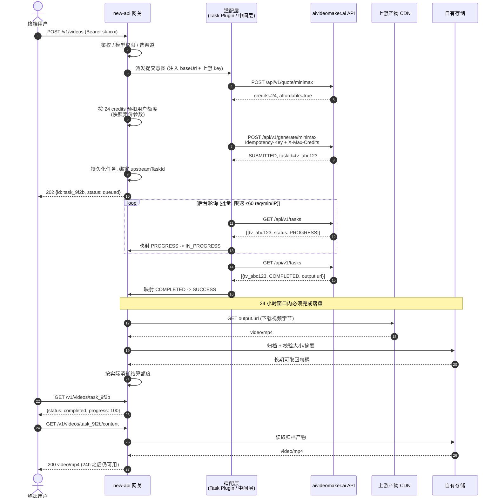

# PRD — AIVideoMaker 反向代理通道 (MiniMax H3)

| 项 | 值 |
|---|---|
| 文档版本 | v1.0 |
| 撰写人 | 许清楚（Xu）· Product Manager |
| 日期 | 2026-09-10 |
| 上游调研输入 | `docs/upstream/api-research.md`、`docs/upstream/aivideo-openapi.json` |
| 目标读者 | 高见远（架构师，Phase 2）、寇豆码（工程师，Phase 3）、严过关（QA，Phase 4） |
| 语言 | 中文 |
| 上游设计输入 | `docs/architecture/aivideomaker-design.md`（v1.0，高见远） |

---

## 版本修订说明

### v1.1（2026-09-10，本次修订）

架构师高见远基于 `QuantumNous/new-api` @ `main`（`v1.0.0-rc.36`）**源码逐行核查**，推翻了 v1.0 的三处实现假设。我已用 `gh api` 独立复核了全部关键结论（见 §7.3 复核记录），确认成立并据此修订。修订均为**能力约束**而非偏好。

| # | 结论 | 受影响的 PRD 条目 | 修订动作 |
|---|---|---|---|
| 1 | **宿主不持久化媒体**：`GetTaskArtifactStore()` 恒返回 disabled 实现，字节经 `io.Copy` 实时转发 | R-07、§3.1、Q-1、RISK-2 | R-07 承担者改为 `aivm-keeper` 边车；**Q-1 关闭（结论：否）**；P0 交付物 +1 |
| 2 | **插件无出站 HTTP 能力**：`injectGlobals` 无 `fetch`，引擎禁 `async/await/import` | R-03、R-10、Q-4 | R-03 改为「本地估算 + `X-Max-Credits` 上界 + 完成时按权威值结算」；**Q-4 关闭（是能力约束，非权衡题）**；R-10 迁移到 keeper |
| 3 | **宿主重试会分配新 `publicTaskId`** ⇒ 幂等键改变 ⇒ 新扣费 | R-03.4、R-04.5 | 两处重试条款**删除**，改为上抛 + 退款 + 告警，以守住 §8.3 的「重复扣费 = 0 笔」硬指标 |
| 4 | 宿主轮询**无指数退避、不读 `Retry-After`**（源码 0 处），失败计数默认 20 × 15s = **5 分钟**即强失败 | R-06、§8.2、新增 RISK-10 | R-06.3 改写；新增「`TASK_POLL_MAX_FAILURES=120`」硬要求与孤儿任务对账（R-25） |
| 5 | `allowedHosts` 精确匹配且被 `credentialless` 绕过 | §6.3 | 修正：CDN 域不必写入 `allowedHosts`，真正要放行的是**出网策略** |

**v1.1 新增的风险**：RISK-10（5 分钟强失败导致「已退款但上游仍在扣费」的双重损失）、RISK-11（keeper 成为永久性数据丢失的单点）、RISK-12（本地价目表陈旧 ⇒ 上游 422 批量失败）。

### v1.0（2026-09-10）

初稿。

---

## 0. 背景与一句话目标

**一句话目标**：让终端用户用 new-api 签发的 `sk-xxx` token，通过 **OpenAI 兼容的 `/v1/videos` 接口**调出 aivideomaker.ai 的 MiniMax H3 视频生成能力，全过程无需感知上游的积分、幂等键、轮询与 24 小时过期机制。

上游（aivideomaker.ai）已确认提供正式 REST API，无需抓包逆向：7 个端点、单 `key` header 鉴权、5 态任务状态机、积分计费（1 credit = $0.01）、**产物仅保留 24 小时**。

> **本 PRD 的一个重要修正**：主理人给出的形态选项为「A 独立 Go 中间层」与「B Fork new-api」二选一。我在调研 new-api 现状后发现存在**第三条官方支持路径 C（Task Plugin，渠道类型 61）**，它在多数维度上同时优于 A 和 B。详见 §4。我仍然对 A/B 给出明确排序，但推荐方案为 C。

---

## 1. 产品目标

| # | 目标 | 可度量标准 |
|---|---|---|
| G-1 | **协议归一**：终端用户以 OpenAI 视频接口语义调用 MiniMax H3，不接触上游任何私有概念 | 用户请求体中不出现 `credits` / `Idempotency-Key` / `tier` 之外的上游字段；标准 OpenAI SDK 可直接跑通 |
| G-2 | **计费可信**：上游积分消耗与 new-api 侧扣费一一对账，失败必退 | 计费漂移 ≤ 1%；FAILURE/CANCEL 任务 100% 退款 |
| G-3 | **产物持久**：突破上游 24 小时保留限制，视频长期可取 | SUCCESS 任务的视频在生成 24 小时之后仍有 ≥ 99.9% 可下载 |
| G-4 | **稳态自愈**：上游限流、瞬时 5xx、余额不足等异常不需要人工介入即可收敛 | 瞬时故障自愈率 ≥ 95%；无任务永久卡在非终态 |
| G-5 | **可扩展**：新增上游模型（其余 8 个）不需要重写主干链路 | 新增一个模型的改动集中在参数映射与定价声明，不触碰轮询/计费/持久化逻辑 |

---

## 2. 用户故事

### 终端用户视角

- **US-1**：作为一名应用开发者，我想用手上的 `sk-xxx` 向 `POST /v1/videos` 提交一段提示词并拿到 `task_id`，这样我就能复用已有的 OpenAI 视频调用代码，不必为多一个供应商单独写 SDK。
- **US-2**：作为一名应用开发者，我想通过 `GET /v1/videos/{task_id}` 轮询到 `queued → in_progress → completed` 的标准状态与 `progress`，这样我能在自己的 UI 上画进度条，而不用理解上游的 `SUBMITTED/PROGRESS` 私有枚举。
- **US-3**：作为一名应用开发者，我想在任务完成一周后仍然能用 `GET /v1/videos/{task_id}/content` 取回视频文件，这样我不必在自己业务里紧急抢救一个 24 小时就失效的链接。
- **US-4**：作为一名成本敏感的用户，我想在提交时得到明确的「本次预计扣多少额度」，并且在生成失败时额度**自动退回**，这样我不会为没拿到的视频付费。
- **US-5**：作为一名应用开发者，当我的提示词被内容审核拒绝时，我想立刻收到一个语义清晰的 4xx 错误而不是一个卡住的任务，这样我能马上改写提示词重试。
- **US-6**：作为一名做图生视频的创作者，我想传入一张首帧图 URL 来驱动生成，这样我能延续已有的美术风格。（P1）

### 运维视角

- **US-7**：作为运维，我想在上游 API Key 余额低于阈值时收到告警，这样我能在用户报错之前完成充值。
- **US-8**：作为运维，我想在日志里用一个 `request_id` 串起「用户请求 → 上游 taskId → 轮询记录 → 落盘产物」的全链路，这样定位一次失败只需一次查询而不是四次。
- **US-9**：作为运维，当上游返回 429 限流时，我希望系统自动退避而不是把限流放大成雪崩，并且我能从指标看板上看到限流发生的频度与恢复时间。
- **US-10**：作为运维，我想清楚知道「上游余额不足」和「用户额度不足」是两类不同故障，前者不应该扣用户的钱也不应该悄悄失败。

### 管理员视角

- **US-11**：作为 new-api 管理员，我想在后台像配置其他渠道一样配置这个通道（填 Base URL + API Key + 可用模型），并能用「渠道测试」验证连通性，这样我不需要读源码就能上线它。
- **US-12**：作为 new-api 管理员，我想为 MiniMax H3 的不同分辨率/档位配置不同价格与倍率，这样我能按成本加成定价而不是一刀切。
- **US-13**：作为 new-api 管理员，我想配置多个上游 API Key 形成密钥池，这样单个 Key 的余额上限和限流不会成为整体吞吐瓶颈。（P1）

---

## 3. 范围与非范围

### 3.1 In-scope（MVP 覆盖）

| 项 | 说明 |
|---|---|
| 模型 | **仅 `minimax`（MiniMax H3）**，通过 new-api 模型名 `aivm-minimax-h3`（turbo）与 `aivm-minimax-h3-base`（base）暴露 |
| 输入模式 | 纯文生视频（`content` + `duration` + `resolution` + `tier` + `aspectRatio`） |
| 上游端点 | `GET /api/v1/account`、`POST /api/v1/quote/minimax`、`POST /api/v1/generate/minimax`、`GET /api/v1/tasks`、`GET /api/v1/tasks/{taskId}` |
| 对外协议 | OpenAI 兼容 `POST /v1/videos`、`GET /v1/videos/{task_id}`、`GET /v1/videos/{task_id}/content` |
| 计费 | 上游 credits → new-api quota 的预扣 / 结算 / 退款闭环 |
| 产物 | 终态成功后的视频持久化落盘（破 24 小时窗口）——**由 P0 新增的 `aivm-keeper` 边车承担**（v1.1 修订，见修订说明 #1） |
| 治理 | 幂等键、消费上限、错误码映射、查询限速退避、密钥健康检查（`doctor` 由 keeper 承担） |
| 质量 | fake upstream 契约测试 + 参数映射单元测试 |

> **v1.1 交付物变更**：因宿主不持久化媒体（修订说明 #1），**P0 交付物在「插件」之外新增一个常驻进程 `aivm-keeper`**（Go 单二进制：周期收割 + read-through 归档网关 + 上游体检）。这是 G-3「产物长期可取」与 R-07 的**唯一交付路径**，无 keeper 则全部视频 24 小时后失效。需主理人确认（架构文档 DM-2）。

### 3.2 Out-of-scope（本期明确不做）

| 项 | 原因 / 去向 |
|---|---|
| 其余 8 个模型（`t2v` / `i2v` / `t2v_v3` / `i2v_v3` / `seedance20` / `wan27` / `happyhorse` / `lv`） | OpenAPI JSON 只详细定义了 `minimax`，其余模型参数矩阵未知 → P1（R-18） |
| 参考素材模式（`referenceImageUrls` / `referenceVideoUrl` / `referenceAudioUrls`） | 与首尾帧互斥，语义复杂 → P1（R-14） |
| 本地文件直传（用户上传二进制而非给 URL） | 上游视频/音频禁止 data URI，需自建图床 → P1（R-15） |
| 任务取消 | 上游仅 `SUBMITTED` 态可取消，窗口极窄、价值低 → P1（R-16） |
| Webhook 回调 | 上游文档提及 `webhookUrl` 但未在 OpenAPI 路径中出现，契约不可信 → P1（R-19） |
| Remix（`POST /v1/videos/{video_id}/remix`） | 上游无对应语义 → P2（R-20） |
| 上游订阅/网页版权益 | 与 API credits 是两套体系（OpenAPI info 明确声明），不在代理范围 |
| 自建视频转码 / 压缩 / 加水印 | 非网关职责 |

---

## 4. 形态决策（关键）

### 4.1 三个候选方案

**A. 独立 Go 中间层 service** — 在 new-api 与 aivideomaker.ai 之间插入自建 HTTP 服务。

⚠️ **A 有一个主理人描述中未展开的硬约束**：new-api 的视频任务路由是**按渠道类型（`channel_type`）解析平台**的，它不存在「任意自定义 HTTP 上游」的视频任务渠道类型。因此一个独立中间层若要**不改 new-api 源码**就被调用到，必须**伪装成 new-api 已支持的某个视频平台协议**（最现实的是 Kling，它有 `KlingRequestConvert` 中间件与 `/kling/v1/videos/text2video` 路由）。这带来两个衍生代价：

1. 必须实现 Kling 的 JWT 签名校验与请求 schema，而 Kling schema **无法表达 MiniMax H3 的 `tier` / `referenceAudioUrls` 等维度** → 参数保真度损失。
2. 一旦上游 new-api 调整 Kling 适配器，我们的伪装层会被动破裂。

换言之：**A 若不做协议伪装，就必然退化成 B**（new-api 得先学会怎么跟我们说话）。

**B. Fork QuantumNous/new-api 加 channel adapter** — 直接改源码注册新 Channel 类型。

**C. new-api Task Plugin（渠道类型 61，官方扩展机制）** — new-api 自 `v1.0.0-rc.27` 起提供 **Task Plugin API v1**：一个单文件、自包含的 JavaScript 模块（`plugin.js`），由 Go 侧 `pkg/jsplugin` 运行时执行，通过 `relay/channel/task/jsplugin/adaptor.go` 桥接到标准 TaskAdaptor 接口。Kling / Jimeng / Vidu / Hailuo / Doubao 等现役视频渠道**已经是用这套机制实现的**。插件通过后台「插件市场」或粘贴 `plugin.js` 原始 URL 安装，宿主校验 sha256 与编译后元数据。

### 4.2 决策矩阵

| 维度 | A（中间层 + 协议伪装） | B（Fork 源码） | **C（Task Plugin）** |
|---|---|---|---|
| 是否侵入 new-api 源码 | 否 | **是** | 否 |
| 网络跳数 | +1 跳 | 0 | 0 |
| 独立运维负担 | **高**（额外服务、部署、监控、SLO） | 无 | **中**（keeper 边车，见下） |
| 参数保真度 | **低**（受伪装协议 schema 限制） | 高 | 高（自定义 `decodeRequest`） |
| **能否调用 `quote` / `account`** | **能** | 能 | **不能**（插件无出站 HTTP） |
| 复用 new-api 预扣/退款计费 | 否，需自建对账 | 是 | **是**（`ForcePreConsume` + 退款链） |
| 复用 new-api 轮询器 | 否，需自建轮询 + 限速 | 是 | **是**（`PollFailures`、`TASK_POLL_MAX_FAILURES`、24h 超时扫描） |
| 复用 OpenAI `/v1/videos` 协议 | 否 | 是 | **是**（`openai_video` 协议钩子） |
| 升级 new-api 的成本 | 低 | **高**（每次 rebase 解冲突） | 低（插件与宿主解耦） |
| 上游可接受度 | N/A | PR 不一定被收 | 有官方插件市场（`QuantumNous/new-api-plugins`） |
| 单元测试友好度 | 高 | 中 | 中（纯函数钩子易测，但需 JS 侧测试栈） |
| **成熟度风险** | 低 | 低 | **高**（插件系统截至 `rc.36` 仍标注实验性、官方"不推荐用于生产"） |

**v1.1 对矩阵的补强（源码证据，来自架构文档 §1.1）**

- **B 的 fork 成本得到量化**：`v1.0.0-rc.32 → rc.36` 在 **4 天内**发布（2026-09-04 → 2026-09-08），且**至今无任何 GA 版本**。⇒ B 的 rebase 是**每天一次**的量级，印证了 v1.0 中"B 的维护成本无上界"的判断。
- **A 新增一个优势但不足以翻盘**：A **能**做 `quote` / `account` 往返（C 不能，见修订说明 #2）。但 A 需自建预扣/结算/退款链、自建轮询与失败计数、自建 `/v1/videos` 协议，且伪装 Kling schema 会丢失 `tier` / `referenceAudioUrls`。**用一整个服务的运维面去换两次 HTTP 往返，不划算。**
- **C 的运维负担从"无"修正为"中"**：宿主不持久化媒体，故 C 同样需要一个 keeper 边车（与 A 相同量级）。这一项不再构成 A 与 C 的差异。

### 4.3 结论

**推荐方案：C（new-api Task Plugin，渠道类型 61），以 A 作为降级预案。**

理由：C 一次性免费获得了本 PRD 需求池里 **R-05 / R-06 / R-09 的绝大部分基础设施**（状态机映射位点、集中式轮询与失败计数、预扣-结算-退款链），而 A 和 B 都要自建或自维护这些。C 同时避开了 B 的 fork 维护成本和 A 的协议保真度损失与额外运维面。

**在主理人给出的 A / B 二选一中，明确推荐 A 优于 B**：B 的 fork 维护成本是**无上界**的（每次上游发版都要 rebase，而 new-api 是高活跃项目），而 A 的额外一跳延迟是**有界且可度量**的（内网 RTT 量级，相对于视频生成分钟级耗时可忽略）。

**决策门（必须在 Phase 2 关闭）**：C 的可行性完全取决于运维将要部署的 new-api 版本。请架构师在系统设计前先确认：

- 若可锁定 `>= v1.0.0-rc.27` 且团队接受实验性插件系统 → **走 C**。
- 若必须运行 GA / 稳定版，或安全策略不接受「插件以管理员级信任运行」→ **走 A（协议伪装成 Kling）**，并接受参数保真度损失（`tier` 降级为按模型名区分）。

为降低这个决策门的破坏力，本 PRD 的需求池刻意做了分层：**R-01～R-04、R-07～R-12 是形态无关的**（契约、映射矩阵、持久化、计费语义、可观测性、测试口径在三种形态下完全一致），只有 **R-05 / R-06 的实现位点**随形态变化。形态翻转不会让本 PRD 失效。

---

## 5. 需求池

优先级定义：**P0 = MVP 必须有**（缺一个就不能上线）；**P1 = 次版本可有可无**；**P2 = 长期可选**。

「实现位点」列在推荐方案 C 下给出；若形态翻转为 A，位点整体平移到中间层 service。

### 5.1 P0 — MVP 必须有

#### R-01 · 文生视频任务提交（OpenAI 兼容）

- **描述**：终端用户以 `POST /v1/videos` 提交 `model` + `prompt` + `seconds` + `size`，同步拿到 `task_id` 与 `status: "queued"`；系统在后台向上游 `POST /api/v1/generate/minimax` 创建任务并持久化 `upstreamTaskId`。
- **验收标准**：
  1. 用标准 OpenAI Python/Node SDK 的 videos.create 调用成功返回 video 对象，`id` 为 new-api 公开 task id（**不得泄漏上游 `tv_xxx`**）。
  2. 响应 `object` 为 `"video"`，`model` 回显用户传入的模型别名（非上游 `minimax`）。
  3. 提交动作为**幂等**：同一逻辑请求重复提交不产生第二个上游任务。
  4. 提交阶段的上游 HTTP 4xx/5xx 全部转化为对用户可读的错误，且**不留下悬空任务记录**。
- **依赖**：R-02、R-03、R-04、R-09。

#### R-02 · 请求参数映射与前置校验

- **描述**：把 OpenAI 视频语义映射为上游 `MiniMaxH3Request`，并在**发出上游请求之前**完成本地校验，避免把可预判的错误浪费成一次上游往返。
**映射规则**：

| OpenAI 字段 | 上游字段 | 规则 |
|---|---|---|
| `prompt` | `content` | 必填，直传 |
| `seconds` | `duration` | 整数 5–20，缺省 5；越界 → 400 |
| `size` | `resolution` + `aspectRatio` | 由宽高**同时**推导短边档位（720p/1080p）与比例；`480p` 上游不支持 → 400 |
| 模型名后缀 | `tier` | `aivm-minimax-h3` → `turbo`；`aivm-minimax-h3-base` → `base` |

- **验收标准**：
  1. `resolution` 仅允许 `720p` / `1080p`；`aspectRatio` 仅允许 `auto|21:9|16:9|4:3|1:1|3:4|9:16`，非法值返回 400 且**不计费**。
  2. 首尾帧字段（`imageUrl`/`lastFrameUrl`）与参考素材字段（`referenceImageUrls`/`referenceVideoUrl`/`referenceAudioUrls`）**互斥校验**在本地完成（即便本期两者都走 P1，校验骨架必须在 P0 就位）。
  3. `referenceImageUrls` ≤ 4 项、`referenceAudioUrls` ≤ 2 项、`referenceVideoUrl` ≤ 1 项。
  4. 视频/音频字段拒绝 `data:` URI（上游仅接受公网 HTTP(S)），本地即返回 400 并说明原因。
  5. `size` → `resolution`/`aspectRatio` 的推导表有穷举单元测试覆盖。
- **依赖**：无。

#### R-03 · 报价护栏与「估算—结算」两段式计费 ⚠️ v1.1 重写

> **v1.1 重写原因（修订说明 #2）**：方案 C 下**插件无出站 HTTP 能力**（`injectGlobals` 无 `fetch`，引擎禁 `async/await/import`），提交链路对上游只发一个请求。因此**提交前调用 `quote` 在方案 C 下不可实现**——这不是权衡题，是能力约束。原验收标准 1「每次提交前有一次 quote 调用」与 3.4「422 后提额重试一次」一并作废。

- **描述**：放弃提交前的权威报价，改为**两段式**：提交时用**内嵌价目表本地估算**预扣 + 设置宽松的 `X-Max-Credits` 护栏；任务完成时按上游权威 `creditsCharged` **结算**，多退少补。
- **价目表（内嵌单一真源）**：沿用 R-09 的 4 档价目，`credits = rate × duration`。**只用于预扣估算与 `X-Max-Credits` 下界，绝不用于最终结算。**
- **`X-Max-Credits` 取值**：`ceil(estimate × 1.5) + 5`。该式**恒偏大**（1.5 倍 + 5 的余量），保证预扣金额 ≥ 实际消耗，使结算方向恒为"退还差额"而非"补扣"——**补扣方向存在用户中途耗尽额度而无法追回的资损风险**，故估算必须向上偏置。
- **验收标准**：
  1. 提交时**不发起** `quote` 请求（提交链路对上游恰好 1 次请求）。
  2. `X-Max-Credits` 必须被设置，且 `= ceil(estimate × 1.5) + 5`。
  3. 任务完成时以**上游权威值**结算：`credits = creditsCharged - creditsRefunded`；宿主按提交时刻的 `TaskBillingContext` 快照计算差额并补扣/退还。
  4. ~~422 后提额重试一次~~ → **已删除**（v1.1，见 R-04 说明）。422 `BUDGET_EXCEEDED` 一律**上抛 + 退款 + P2 告警**，不重试。
  5. **漂移可观测**：日志与 `data` 中同时落 `estimateCredits` / `creditsCharged` / `listValueCents`；漂移 > 1% 触发告警（见 R-09.5）。
  6. **价目表陈旧检测（v1.1 新增）**：对 `BUDGET_EXCEEDED` 单独设指标与告警。该错误**不是用户错误**，而是"上游已调价、本地价目表未更新"的信号 ⇒ 一旦出现即需人工更新价目表（对应 RISK-12）。
- **依赖**：R-09。
- **量化收益**：提交链路上游往返由 2 次降为 1 次 ⇒ §8.1 的 p95 目标由 ≤2000ms **收紧至 ≤1200ms**。
- **遗留资损风险**：若上游单次调价幅度 > 50%，`X-Max-Credits` 会低于真实报价 ⇒ 上游 422 拒绝 ⇒ 任务失败（用户被退款，无资损，但可用性受损）。由标准 6 的告警兜底。

#### R-04 · 幂等键治理

- **描述**：为每个逻辑生成分配**稳定且唯一**的 `Idempotency-Key`，使网络抖动导致的重试绝不产生重复扣费。
- **验收标准**：
  1. Key 长度落在上游约束 8–128 字符内。
  2. Key 由 new-api 的 `request_id`（或等价的任务唯一标识）派生，**绝不使用时间戳等易变值**。
  3. 同一逻辑生成的重试复用同一 Key；不同逻辑生成绝不复用。
  4. 上游响应 `idempotentReplay: true` 时，系统识别该标志并**不再创建新任务、不再二次扣费**，直接复用已有 `taskId`。
  5. 上游返回 409 `IDEMPOTENCY_CONFLICT` 时记为**内部缺陷级告警**（说明 Key 复用逻辑有 bug），换新 Key 重试一次。
- **依赖**：R-01。

#### R-05 · 任务状态机映射（5 态 → 7 态 → OpenAI 5 态）

- **描述**：上游 5 态需映射到 new-api 的 `TaskStatus`（7 态），再由 `ToVideoStatus()` 映射为 OpenAI 视频状态。这是**三段映射**，必须逐段定义清楚。
**映射表**：

| 上游 | new-api TaskStatus | OpenAI status | 处理动作 |
|---|---|---|---|
| `SUBMITTED` | `SUBMITTED` | `queued` | 继续轮询 |
| `PROGRESS` | `IN_PROGRESS` | `in_progress` | 继续轮询 |
| `COMPLETED` | `SUCCESS` | `completed` | **立即触发落盘**（R-07），停止轮询 |
| `FAILED` | `FAILURE` | `failed` | 退款（上游已自动退积分），不重试 |
| `CANCEL` | `FAILURE` + 错误码 `CANCELLED` | `failed` | 退款，不重试 |

- **验收标准**：
  1. 五种上游状态各有独立测试用例，断言三段映射结果。
  2. **无法识别的上游状态字符串必须映射为 `UNKNOWN`，严禁兜底成 `IN_PROGRESS`**（否则任务会假装还在跑直到 24 小时超时）。
  3. `CANCEL` 虽然在 new-api 侧收敛为 `FAILURE`，但错误信息中必须保留"用户取消"语义以便审计区分。
  4. 任何非终态任务不得停留超过 `TASK_TIMEOUT_MINUTES`（默认 24h）而无终态结论。
- **依赖**：R-08、R-09。

#### R-06 · 批量轮询与查询限速治理

- **描述**：上游查询端点为 **60 req/min/IP 共享额度**。若按「每任务一次轮询」实现，N 个并发任务会线性放大请求量并触发 429 雪崩。
- **关键设计输入**：上游 `GET /api/v1/tasks` **一次返回当前 key 的全部任务**（newest first）。这意味着**一次请求即可覆盖该 key 下所有在飞任务**，是天然的批量查询端点。**强烈建议采用批量轮询模式**（方案 C 下即 `fetchMode` 走批量 + `buildBatchQueryRequest`/`parseBatchResult`），而非逐任务查询。
- **验收标准**：
  1. 单个上游 key 每个轮询周期的查询请求数为 **O(1)**，而非 O(在飞任务数)。
  2. 全局查询速率有令牌桶或等价限速器约束在 60 req/min/IP 以下（含安全余量）。
  3. 收到 429 时执行**指数退避 + jitter**，且尊重 `Retry-After` header。
  4. 429 / 5xx / 传输错误递增连续失败计数；一次有效的 2xx 非终态解析将计数**重置为 0**。
  5. 连续失败达上限（方案 C 下为 `TASK_POLL_MAX_FAILURES`，默认 20）后任务转 `FAILURE` 并走退款链。
  6. 上游 404 / 410（任务不存在或已清理）→ **立即终态 FAILURE + 退款**，不消耗重试预算。
  7. 上游 401 / 403 → **保持任务状态不变**、递增失败计数、记录带渠道 ID 的告警，**不得**因轮询鉴权失败而自动禁用渠道（避免一次误报打掉整条通道）。
- **依赖**：R-05、R-10。
- **待确认**：`GET /api/v1/tasks` 是否支持分页/条数限制？若某 key 历史任务累积到数千条，newest-first 是否仍能覆盖全部在飞任务？→ Q-2。

#### R-07 · 终态产物持久化（突破 24 小时窗口）

- **描述**：上游明确**成品文件仅保留 24 小时**。系统必须在拿到 `output.url` 后主动把视频落到自有存储，并对终端用户暴露长期有效的取回入口。
- **验收标准**：
  1. 任务进入 `SUCCESS` 后，**在 24 小时窗口内**（目标：≤ 5 分钟内）完成视频下载并落盘到对象存储或本地卷。
  2. `GET /v1/videos/{task_id}/content` 在生成 24 小时之后仍能取回视频字节。
  3. 落盘失败具备有界重试（指数退避）；重试耗尽后**标记为可人工补救**并告警，**不得静默丢失**。
  4. 落盘记录包含内容校验（大小或摘要），可检出截断下载。
  5. 系统不把上游 CDN 裸 URL 作为**唯一**交付路径（可作为附加字段返回，但不得是唯一手段）。
- **依赖**：R-05。
- **⚠️ 形态强约束**：方案 C 下，插件是**单文件、同步、无 import 的 JS 模块，且宿主设计上不让 JS 接触文件字节**——因此**插件自身无法实现下载器**。落盘必须由宿主的 artifact/content 机制承担，或由一个**外部 harvester 边车**（轮询 new-api 自身的任务接口，发现终态后下载归档）承担。**这是 Phase 2 必须先验证再设计的关键未知**（见 Q-1），因为它决定 P0 是否需要额外交付一个边车进程。

#### R-08 · 错误码分级映射矩阵

- **描述**：上游 5 个已知 `errorCode` 与 7 类 HTTP 状态必须映射为「给用户的 4xx」「给运维的告警」「可重试 / 不可重试」三个正交维度。
**映射矩阵**：

| 上游 | HTTP | 归类 | 对用户 | 退款 | 重试 | 告警 |
|---|---|---|---|---|---|---|
| `AUTH_FAILED` | 401 | **配置错误** | 502 通道不可用 | 是 | 否 | **P1 告警** |
| `INSUFFICIENT_CREDITS` | 402 | **运营错误**（上游余额耗尽） | 503 稍后重试 | 是 | 否（禁止无限重试） | **P1 告警 + 充值提醒** |
| `BUDGET_EXCEEDED` | 422 | **内部错误**（报价漂移） | 500 | 是 | 至多 1 次 | P2 告警 |
| `IDEMPOTENCY_CONFLICT` | 409 | **内部缺陷** | 500 | 是 | 至多 1 次（换新 Key） | P2 告警 |
| `RATE_LIMITED` | 429 | **瞬时** | 429 + `Retry-After` | 视终态 | 是（退避） | 频度超阈值才告警 |
| 内容审核拒绝 | 422 | **用户错误** | 400 + 可读原因 | 是 | 否 | 记录供审计 |
| 参数非法 | 400 | **用户错误** | 400 | 是 | 否 | 否 |

- **验收标准**：
  1. 矩阵中每一行都有对应测试用例（fake upstream 构造该响应，断言用户侧状态码、退款发生、重试次数、告警触发）。
  2. **上游错误消息经脱敏后**才可回传用户，绝不泄漏上游 API Key、内部 URL 或 `tv_xxx` 任务号。
  3. `200` 响应体中携带 `status: "FAILED"` 的**业务级失败**能被正确识别（上游存在 200 + 错误体的情况），不得因 HTTP 200 就判成功。
  4. 未知 `errorCode` 有默认分支：归为不可重试 + 上抛 + 告警，不得静默吞掉。
- **依赖**：R-05。

#### R-09 · 计费映射与预扣 / 结算 / 退款闭环

- **描述**：上游按 credits 计费（1 credit = $0.01，`credits = credits_per_sec × duration`），new-api 按 USD quota 扣费。必须建立单一可信的换算链，且失败必退。
**上游价目**：

| 配置 | credits/秒 | USD/秒 |
|---|---|---|
| 720p turbo | 3 | $0.03 |
| 720p base | 4 | $0.04 |
| 1080p turbo | 4 | $0.04 |
| 1080p base | 5 | $0.05 |

默认（720p + turbo + 5s）= 15 credits = $0.15。

- **验收标准**：
  1. 提交时按 `quote` 的权威 `credits` **预扣**用户额度（方案 C 下复用 `ForcePreConsume`）。
  2. 定价参数在**提交时刻快照**，后续全局倍率调整不影响已在飞任务的结算金额。
  3. 终态 `SUCCESS` 按实际消耗结算；`FAILURE` / `CANCEL` **全额退款**。
  4. 用量上报以 credits（或秒数 + 档位）为事实向量，使管理员能按 credit 单价配置加成定价，**不需要为 4 种分辨率×档位组合各建一个模型名**。
  5. 与上游 `creditsCharged` / `creditsRefunded` / `listValueCents` 字段对账，漂移 > 1% 触发告警。
  6. **上游余额不足绝不转化为用户扣费**（这是 R-08 中 `INSUFFICIENT_CREDITS` 的计费侧要求）。
- **依赖**：R-03、R-05、R-08。
- **待确认**：new-api 的 quota 单位换算基数（默认 1 USD = 500,000 quota）需与运维确认实例配置 → Q-5。

#### R-10 · 上游密钥健康检查与余额告警

- **描述**：利用上游**非计费** doctor 端点 `GET /api/v1/account` 实现渠道连通性测试与余额监控。
- **验收标准**：
  1. new-api 后台「渠道测试」按钮可用，底层打到 `/api/v1/account`，返回 key 有效性 + 余额 + 支持模型列表；**测试动作不产生任何计费**。
  2. 定期（建议 ≤ 5 分钟）采集余额；低于可配置阈值时告警（默认阈值建议 = 单次最贵生成成本 × 10，即 100 credits）。
  3. Key 无效 / 禁用 / 删除（401）时告警并将渠道标记为不健康。
  4. 余额与限流护栏信息进入指标看板，可回答"还能生成多少秒视频"。
- **依赖**：无。

#### R-11 · 可观测性（全链路可追溯）

- **描述**：一次失败的定位必须只需一次查询。
- **验收标准**：
  1. 结构化日志字段至少包含：`request_id`、new-api 公开 `task_id`、上游 `upstream_task_id`、`channel_id`、`model`、`idempotency_key`、`credits_quoted`、`credits_charged`、`upstream_status`、`mapped_status`、`error_code`、`poll_failures`、`artifact_url`。
  2. 上述字段能用**任一个** ID 串起从提交到落盘的完整时间线。
  3. 指标至少覆盖：提交 QPS、提交延迟 p50/p95、端到端生成耗时分布、各终态计数、429 计数与恢复时长、落盘成功率与耗时、上游余额、预扣/退款金额。
  4. **日志与指标中一律不得出现上游 API Key 明文**。
- **依赖**：R-01、R-05、R-08。

#### R-12 · 测试：fake upstream 契约测试 + 参数映射单元测试

- **描述**：不依赖真实上游即可验证全部映射与异常分支。
- **验收标准**：
  1. 提供一个 fake aivideomaker server，可按用例编排每个端点的 200 / 400 / 401 / 402 / 409 / 422 / 429 / 5xx 响应，以及 200 + `status: FAILED` 业务错误体。
  2. R-08 矩阵每一行、R-05 状态映射每一态均有自动化用例。
  3. 覆盖幂等重放（`idempotentReplay: true`）路径，断言不二次扣费、不二次建任务。
  4. 覆盖 24 小时过期边界：`COMPLETED` 后落盘前 URL 失效 → 断言重试与告警行为（R-07.3）。
  5. 覆盖限速：构造持续 429，断言退避、`Retry-After` 尊重、失败计数递增与上限转终态。
  6. **测试不得因外部依赖缺失而静默跳过**——跳过必须让 CI 失败（防虚假绿灯）。
- **依赖**：R-01～R-11。

### 5.2 P1 — 次版本

| # | 标题 | 描述 | 验收标准 | 依赖 |
|---|---|---|---|---|
| R-13 | 首帧 / 尾帧图生视频 | 支持 `imageUrl`、`lastFrameUrl`，映射自 OpenAI `input_reference` | 公网 URL 与 `data:image/...;base64,...` 两种入参均可用；与参考素材互斥校验生效 | R-02 |
| R-14 | 参考素材模式 | 支持 `referenceImageUrls`(≤4) / `referenceVideoUrl`(1) / `referenceAudioUrls`(≤2) | 数量上限校验；与首尾帧互斥；视频/音频拒绝 data URI | R-02、R-13 |
| R-15 | 本地媒体入站 | 用户上传二进制而非给 URL | 图片走 data URI 直转；**视频/音频必须先落到公网可访问存储再取 URL**（上游禁 data URI）；超限文件明确报错 | R-13、R-14、R-07 |
| R-16 | 任务取消 | 暴露取消能力，映射到 `PUT /api/v1/tasks/{taskId}/cancel` | 仅 `SUBMITTED` 态可取消；`PROGRESS` 态返回明确的"已不可取消"；取消成功后退款 | R-05、R-09 |
| R-17 | 多密钥池化与余额路由 | 多个上游 key 组池，突破单 key 余额与限流上限 | 按余额/健康度选 key；单 key 429 不影响其他 key；**每个 key 独立的 60 req/min 轮询预算独立计算** | R-06、R-10 |
| R-18 | 其余 8 个模型扩展 | `t2v`/`i2v`/`t2v_v3`/`i2v_v3`/`seedance20`/`wan27`/`happyhorse`/`lv` | 每个模型有独立参数映射表与定价声明；**主干轮询/计费/持久化链路零改动** | 先补调研（Q-3） |
| R-19 | Webhook 替代轮询 | 若上游 `webhookUrl` 确实可用，用回调替代轮询以彻底解掉 60 req/min 约束 | 回调签名校验；回调丢失时轮询作为兜底**不得移除** | Q-6 |

### 5.3 P2 — 长期可选

| # | 标题 | 描述 | 验收标准 |
|---|---|---|---|
| R-20 | Remix | 对接 `POST /v1/videos/{video_id}/remix` | 上游若无对应语义则明确返回 501，不假装支持 |
| R-21 | 内容审核前置 | 提交前本地预筛，减少 422 浪费 | 误杀率可控；被拦请求不计费 |
| R-22 | 成本看板 | 按用户/模型/档位聚合 credits 消耗与毛利 | 与上游 `listValueCents` 对账一致 |
| R-23 | 发布到官方插件市场 | 若走方案 C，向 `QuantumNous/new-api-plugins` 提交插件 | 通过官方 sha256 与元数据校验 |
| R-24 | 多供应商降级 | MiniMax H3 不可用时降级到备用视频供应商 | 降级对用户透明；计费按实际供应商结算 |

---

## 6. 接口契约草图

> 以下只到「路径 + 方法 + 请求 + 响应」层面，不下到语言级类型定义。

### 6.1 new-api 暴露给终端用户的接口

**采用 OpenAI 兼容的视频接口**，不自造路径。new-api 现有路由已提供：

| 用途 | 方法与路径 | 说明 |
|---|---|---|
| 创建视频任务 | `POST /v1/videos` | **主推**，OpenAI 官方视频语义 |
| 查询任务 | `GET /v1/videos/{task_id}` | 返回 OpenAI video 对象 |
| 取回视频内容 | `GET /v1/videos/{task_id}/content` | 支持 `GET` 与 `HEAD`，无请求体 |
| 创建（遗留别名） | `POST /v1/video/generations` | 兼容旧客户端 |
| 查询（遗留别名） | `GET /v1/video/generations/{task_id}` | 兼容旧客户端 |

鉴权：`Authorization: Bearer sk-xxx`（new-api 签发的 token）。内容取回端点同时接受 token 与登录会话，并校验任务归属。

**创建请求**

```json
{
  "model": "aivm-minimax-h3",
  "prompt": "A cinematic candle on a wooden table, slow dolly in",
  "seconds": "8",
  "size": "1280x720"
}
```

字段说明：`model` 的 `-base` 后缀变体（`aivm-minimax-h3-base`）选择上游 `tier: base`；`size` 同时决定 `resolution` 与 `aspectRatio`；`seconds` 取 5–20。

**创建响应（202 语义，同步返回 task 句柄）**

```json
{
  "id": "task_9f2b7c1e",
  "object": "video",
  "model": "aivm-minimax-h3",
  "status": "queued",
  "progress": 0,
  "created_at": 1789041000,
  "completed_at": null,
  "seconds": "8",
  "size": "1280x720"
}
```

**查询响应（成功终态）**

```json
{
  "id": "task_9f2b7c1e",
  "object": "video",
  "model": "aivm-minimax-h3",
  "status": "completed",
  "progress": 100,
  "created_at": 1789041000,
  "completed_at": 1789041222,
  "seconds": "8",
  "size": "1280x720"
}
```

> 注意：`id` / `object` / `model` / `status` / `progress` / `created_at` / `completed_at` 由 new-api 宿主权威覆写，适配层不得自行伪造；上游任务号 `tv_xxx` **必须**被替换为公开 `task_id`。视频字节通过 `/content` 取回。

**查询响应（失败终态）**

```json
{
  "id": "task_9f2b7c1e",
  "object": "video",
  "model": "aivm-minimax-h3",
  "status": "failed",
  "progress": 0,
  "created_at": 1789041000,
  "completed_at": 1789041090,
  "error": {
    "code": "content_rejected",
    "message": "The prompt was rejected by the upstream content policy. Please revise and retry."
  }
}
```

### 6.2 适配层 → 上游 aivideomaker.ai 的调用链

所有上游请求携带 `key: <上游 API Key>`（由 new-api 渠道配置注入，**绝不来自用户请求**）。

**① 健康检查 / 渠道测试（非计费）**

```json
{
  "method": "GET",
  "url": "{baseUrl}/api/v1/account",
  "headers": { "key": "<UPSTREAM_API_KEY>" }
}
```

**② 权威报价（非计费）**

```json
{
  "method": "POST",
  "url": "{baseUrl}/api/v1/quote/minimax",
  "headers": { "key": "<UPSTREAM_API_KEY>", "Content-Type": "application/json" },
  "body": {
    "content": "A cinematic candle on a wooden table, slow dolly in",
    "duration": 8,
    "resolution": "720p",
    "tier": "turbo",
    "aspectRatio": "16:9"
  }
}
```

响应（权威价格，用于预扣与 `X-Max-Credits`）：

```json
{
  "model": "minimax",
  "credits": 24,
  "listPriceUsd": 0.24,
  "usdPerCredit": 0.01,
  "currentBalance": 50,
  "affordable": true,
  "billable": false
}
```

**③ 创建任务（计费）**

```json
{
  "method": "POST",
  "url": "{baseUrl}/api/v1/generate/minimax",
  "headers": {
    "key": "<UPSTREAM_API_KEY>",
    "Content-Type": "application/json",
    "Idempotency-Key": "<derived-from-request_id, 8..128 chars, stable>",
    "X-Max-Credits": "24"
  },
  "body": {
    "content": "A cinematic candle on a wooden table, slow dolly in",
    "duration": 8,
    "resolution": "720p",
    "tier": "turbo",
    "aspectRatio": "16:9"
  }
}
```

响应：

```json
{
  "status": "SUBMITTED",
  "taskId": "tv_abc123",
  "creditsCharged": 24,
  "idempotentReplay": false,
  "responseUrl": "https://aivideomaker.ai/api/v1/tasks/tv_abc123",
  "statusUrl": "https://aivideomaker.ai/api/v1/tasks/tv_abc123/status",
  "cancelUrl": "https://aivideomaker.ai/api/v1/tasks/tv_abc123/cancel"
}
```

**④ 批量轮询（非计费，推荐：一次覆盖该 key 全部在飞任务）**

```json
{
  "method": "GET",
  "url": "{baseUrl}/api/v1/tasks",
  "headers": { "key": "<UPSTREAM_API_KEY>" }
}
```

响应（newest first）：

```json
{
  "tasks": [
    {
      "id": "tv_abc123",
      "createdAt": "2026-09-10T12:30:00Z",
      "model": "minimax",
      "input": { "content": "..." },
      "output": { "url": "https://cdn.../video.mp4", "msg": "ok", "error": null },
      "status": "COMPLETED",
      "creditsCharged": 24,
      "creditsRefunded": 0,
      "listValueCents": 24,
      "idempotencyKey": "req-9f2b7c1e-...",
      "completedAt": "2026-09-10T12:33:42Z"
    }
  ]
}
```

**⑤ 单任务兜底查询（当 ④ 不可用或分页覆盖不到时）**

```json
{
  "method": "GET",
  "url": "{baseUrl}/api/v1/tasks/{upstreamTaskId}",
  "headers": { "key": "<UPSTREAM_API_KEY>" }
}
```

**⑥ 取消（P1）**

```json
{
  "method": "PUT",
  "url": "{baseUrl}/api/v1/tasks/{upstreamTaskId}/cancel",
  "headers": { "key": "<UPSTREAM_API_KEY>" }
}
```

### 6.3 网络出口白名单

适配层需要访问**两类 host**：

1. 上游 API host（`aivideomaker.ai`）——即渠道 Base URL。
2. **产物 CDN host**（`output.url` 指向的下载域）——与 API host **可能不同**，必须显式加入出口白名单，否则落盘（R-07）会被拦截。方案 C 下对应插件 `meta.allowedHosts`；方案 A 下对应中间层的出网策略。

> 这是一个容易被漏掉、且只在真实生成成功后才暴露的坑。→ Q-7

### 6.4 端到端序列图



**失败路径补充**（未画入主图以保持可读性）：

- 上游 `FAILED` / `CANCEL` → 映射 `FAILURE` → 触发全额退款 → 用户查询得到 `status: failed` + 脱敏错误。
- 轮询连续失败达上限 → 强制终态 `FAILURE` + 退款。
- 上游 404 / 410 → 立即终态 `FAILURE` + 退款（不消耗重试预算）。
- 落盘失败 → 有界重试；耗尽后标记人工补救 + 告警（任务仍为 SUCCESS，但产物待补）。

---

## 7. 关键风险与待确认问题

### 7.1 风险

| # | 风险 | 影响 | 缓解 | 负责人 |
|---|---|---|---|---|
| RISK-1 | **new-api 插件系统仍为实验性**：Task Plugin 自 `v1.0.0-rc.27` 引入，截至 `rc.36` 官方仍标注"实验性、不推荐用于生产"，且涉及较大架构调整 | 推荐方案 C 可能不可用，形态需翻转 | Phase 2 开工前先锁定 new-api 版本；PRD 已按「形态无关需求 + 形态相关需求」分层，翻转不作废（§4.3） | 高见远（架构师）+ 齐活林（版本决策） |
| RISK-2 | **24 小时产物过期 + 插件无法自建下载器**：方案 C 下 JS 插件不接触文件字节，落盘只能靠宿主机制或外部边车；宿主是否真的持久化媒体**未在官方文档中记载** | R-07 无法交付 → 视频 24 小时后全部失效，这是产品级致命缺陷 | Phase 2 **第一优先级**验证宿主 artifact/content 行为（读源码，不靠文档）；若宿主不持久化，P0 需追加 harvester 边车 | 高见远（架构师） |
| RISK-3 | **上游查询限速 60 req/min/IP 与并发规模冲突** | 高并发下 429 雪崩、任务状态更新延迟、误判失败 | 采用批量轮询（`GET /api/v1/tasks` 一次覆盖全部在飞任务）+ 令牌桶 + 退避；多 key 池化时按 key 独立预算 | 寇豆码（工程师） |
| RISK-4 | **多实例部署时限速与轮询重复**：若 new-api 多副本各自轮询，60 req/min/IP 预算会被成倍消耗 | 限流触发概率随副本数线性上升 | Phase 2 明确轮询是否单例（领导者选举 / 分布式锁 / 节点身份），并在部署文档中固化 | 高见远（架构师） |
| RISK-5 | **插件以管理员级信任运行**：官方明确安装的插件在网关上以管理员级信任执行，可访问渠道凭据 | 安全合规可能否决方案 C | 提交安全评审；插件源码走内部 review + sha256 固定版本；不从第三方市场安装 | 齐活林（主理人） |
| RISK-6 | **计费单位三重换算**：上游 credits → USD → new-api quota，任一环节口径不一致即产生系统性漂移 | 长期亏损或超收，且难以发现 | 以上游 `quote` 为唯一价格来源；用量按 credits 上报；与 `listValueCents` 定期对账并设 1% 漂移告警（R-09.5） | 寇豆码（工程师）+ 许清楚（定价口径） |
| RISK-7 | **产物 CDN 域与 API 域不同**，出口白名单漏配 | 生成成功但落盘全失败，且只在真实成功后才暴露 | 集成测试必须走一次真实生成并断言落盘成功；白名单显式配置（§6.3） | 严过关（QA） |
| RISK-8 | **其余 8 个模型契约未知**：官网文档分散在中/英/西/德多个子站，OpenAPI 只定义了 `minimax` | R-18 无法排期，对外能力承诺有风险 | 本期对外**只承诺 MiniMax H3**；R-18 前置一轮独立调研 | 许清楚（PM）+ 齐活林 |
| RISK-9 | **上游 `tier` 维度无 OpenAI 对应字段** | 用模型名后缀编码 tier 会让模型列表膨胀；若未来维度增多不可扩展 | 本期仅 turbo/base 两个变体可接受；若上游新增维度，改走请求扩展字段 | 许清楚（PM） |

### 7.2 待确认问题（❓ = 当前无可靠答案，不臆测）

| # | 问题 | 为何重要 | 负责人 | 期限 |
|---|---|---|---|---|
| Q-1 | ❓ new-api 宿主的 `artifact` / `content` 钩子**是否真的把上游媒体下载并持久化到自有存储**？保留多久？存储后端是本地卷还是对象存储？官方 plugin-api 文档**完全没有记载**（仅说明 `ctx.artifacts[key].url` 是宿主注入） | 直接决定 R-07 能否交付，以及 P0 是否要多交付一个 harvester 边车 | 高见远（架构师，**读源码验证，不接受文档推断**） | Phase 2 开工首日 |
| Q-2 | ❓ `GET /api/v1/tasks` 是否支持分页 / 条数上限？历史任务累积到数千条时，newest-first 能否稳定覆盖全部在飞任务？ | 决定批量轮询（R-06）是否可靠，以及是否必须保留单任务兜底 | 寇豆码（工程师，实测） | Phase 3 前 |
| Q-3 | ❓ 其余 8 个模型的参数矩阵与价目？OpenAPI 仅有 `/api/v1/generate/minimax` 一条生成路径，其他模型是否共用 `/api/v1/generate/{model}` 模式？ | 决定 R-18 的工作量与主干抽象是否够通用 | 齐活林（补充调研） | R-18 排期前 |
| Q-4 | ❓ 是否可以省掉提交前的 `quote` 往返，改为「本地按价目表估算 + `X-Max-Credits` 兜底」？上游价目是否稳定到可以本地缓存？ | 每次提交省一次往返，直接影响提交延迟 p95 指标 | 高见远（架构师权衡） | Phase 2 |
| Q-5 | ❓ 目标 new-api 实例的 quota 换算基数（默认 1 USD = 500,000 quota）与站点货币设置？rc.36 说明「定价货币可切为站点货币，额度仍按美元扣费」 | 计费映射（R-09）的常量来源，配错即系统性漂移 | 齐活林（运维确认） | Phase 2 |
| Q-6 | ❓ 上游 `webhookUrl` 到底是否可用？调研报告指出文档提及但**未出现在 OpenAPI 路径中**，契约不可信 | 若可用，R-19 能彻底解掉 60 req/min 约束；若不可用，不应写进架构 | 齐活林（向上游确认或实测） | R-19 排期前 |
| Q-7 | ❓ `output.url` 的实际 CDN 域名是什么？是否稳定（会不会按任务随机分配子域）？是否带签名且有独立有效期（可能短于 24 小时）？ | 决定出口白名单怎么配（§6.3），以及落盘的时间窗到底有多紧 | 寇豆码（工程师，首次真实生成时记录） | Phase 3 |
| Q-8 | ❓ 上游 `/api/v1/generate/*` 的**生成端点限速**是多少？OpenAPI 只说明查询端点共享 60 req/min，生成端点 429 描述为"API-key generation rate limit exceeded"但未给数值 | 决定提交侧是否也需要限速器与排队 | 寇豆码（工程师，实测） | Phase 3 |
| Q-9 | ❓ 内容审核拒绝时上游返回的 `errorCode` 具体是什么？调研只说"消息可能模糊"，未给出确切枚举值 | R-08 矩阵中"内容审核拒绝"这一行目前只能按 HTTP 422 归类，缺精确错误码 | 严过关（QA，用违规提示词实测） | Phase 4 |
| Q-10 | ❓ 上游单 key 的默认余额上限（调研称"默认 50 credits 起"）与充值方式？是否支持自动续费？ | 决定 R-10 告警阈值与 R-17 池化策略的实际必要性 | 齐活林（商务/账号侧确认） | Phase 2 |

---

## 8. 成功指标

### 8.1 性能

| 指标 | 目标 | 说明 |
|---|---|---|
| 提交接口延迟 p50 | ≤ 800 ms | `POST /v1/videos` 返回 task 句柄的耗时，**不含生成时间**；含一次 `quote` 往返 |
| 提交接口延迟 p95 | ≤ 2,000 ms | 若 Q-4 决定省掉 `quote`，目标收紧至 p95 ≤ 1,200 ms |
| 查询接口延迟 p95 | ≤ 300 ms | 读本地任务状态，不触发上游查询 |
| 端到端生成耗时（720p/turbo/5s） | p50 / p95 **待基线测量** ❓ | 受上游算力影响，**不由本项目控制**；上线前必须先跑 30 次采样建立基线，再据此设 SLO。此处不编造数字 |
| 状态更新滞后 | ≤ 1 个轮询周期 | 上游进入终态到 new-api 侧反映终态的延迟 |

### 8.2 可靠性

| 指标 | 目标 |
|---|---|
| 提交成功率（排除用户参数错误与内容审核） | ≥ 99.5% |
| 因代理自身缺陷导致的失败率 | ≤ 0.1% |
| 轮询触发的 429 占查询请求比例 | ≤ 0.5% |
| 瞬时故障（429 / 5xx / 传输错误）自愈率 | ≥ 95%（无人工介入即收敛到终态） |
| 卡在非终态超过 24 小时的任务数 | **0**（硬指标） |
| 落盘成功率（首次尝试） | ≥ 99% |
| 产物 24 小时后可取回率 | ≥ 99.9%（G-3 核心指标） |
| FAILURE / CANCEL 任务退款完成率 | 100%，且 ≤ 60 秒内完成 |

### 8.3 成本与计费

| 指标 | 目标 |
|---|---|
| 计费漂移（new-api 扣费 vs 上游 `listValueCents`） | ≤ 1% |
| 上游余额不足导致的用户误扣费 | **0 笔**（硬指标） |
| 幂等失效导致的重复扣费 | **0 笔**（硬指标） |
| 单位成本基准（720p/turbo） | 3 credits/秒 = $0.03/秒；5 秒默认生成 = 15 credits = $0.15 |
| 单位成本上限（1080p/base） | 5 credits/秒 = $0.05/秒；20 秒最长生成 = 100 credits = $1.00 |
| 成本可解释性 | 任意一笔扣费可在日志中还原为 `credits/秒 × 秒数 × 倍率` |

### 8.4 交付质量

| 指标 | 目标 |
|---|---|
| R-08 错误矩阵用例覆盖 | 100%（每行一例） |
| R-05 状态映射用例覆盖 | 100%（5 态全覆盖 + UNKNOWN 分支） |
| 因外部依赖缺失而跳过的测试 | **0 个**（跳过即 CI 失败，防虚假绿灯） |
| 管理员上线所需文档外的源码阅读量 | 0（US-11：后台配置即可上线） |

---

## 9. 术语表

| 术语 | 含义 |
|---|---|
| **MiniMax H3** | 上游 aivideomaker.ai 提供的视频生成模型，API 中模型标识为 `minimax`。本期唯一在范围内的模型。列表价 $0.03–$0.05 / 生成秒 |
| **credits（积分）** | 上游计费单位，**1 credit = $0.01**。计算式 `credits = credits_per_sec × duration`。与上游网页版订阅权益是**两套独立体系** |
| **quota** | new-api 的内部额度单位，按 USD 扣费（默认 1 USD = 500,000 quota，实例可配 → Q-5） |
| **`Idempotency-Key`** | 上游请求 header，8–128 字符。同 Key + 同 payload → 返回原任务且不二次扣费；同 Key + 不同 payload → 409 `IDEMPOTENCY_CONFLICT` |
| **`X-Max-Credits`** | 上游请求 header，声明"本次最多允许扣 N credits"。上游在**预扣之前**比对权威报价，超出则 422 拒绝且不创建任务 |
| **`idempotentReplay`** | 上游创建响应中的布尔标志。为 `true` 表示这是一次幂等重放（未二次扣费），代理必须识别并禁止重复建任务 |
| **`listValueCents`** | 上游任务字段，表示净消耗积分的列表价价值（单位：美分）。用于对账，**不等于**实际支付收入 |
| **quote（报价）** | 上游非计费端点 `POST /api/v1/quote/{model}`，是**权威价格来源**。禁止在客户端重算积分 |
| **doctor 端点** | 上游非计费端点 `GET /api/v1/account`，返回 key 有效性、余额、护栏与支持模型，用于渠道健康检查 |
| **上游状态机** | `SUBMITTED → PROGRESS → COMPLETED / FAILED / CANCEL`（5 态）。`CANCEL` 仅在 `SUBMITTED` 态可达 |
| **`TaskStatus`（new-api）** | new-api 内部 7 态：`NOT_START` / `SUBMITTED` / `QUEUED` / `IN_PROGRESS` / `SUCCESS` / `FAILURE` / `UNKNOWN` |
| **`ToVideoStatus()`** | new-api 内部映射函数，把 7 态 `TaskStatus` 收敛为 OpenAI 视频 5 态：`queued` / `in_progress` / `completed` / `failed` / `unknown` |
| **Task Plugin（渠道类型 61）** | new-api 官方扩展机制（`v1.0.0-rc.27+`，实验性）。单文件自包含 JS 模块，由 `pkg/jsplugin` 运行时执行，经 `relay/channel/task/jsplugin/adaptor.go` 桥接为标准 TaskAdaptor。现役 Kling / Jimeng / Vidu / Hailuo 等视频渠道即用此实现。绑定需 `task_plugin.bind` 权限 |
| **TaskAdaptor** | new-api 的异步任务适配器接口，抽象「提交 → 轮询 → 解析结果」三段能力 |
| **`ForcePreConsume`** | new-api 计费机制：任务提交时按最大预估额度**强制预扣**，终态时结算或退款 |
| **`TaskBillingContext`** | new-api 在提交时刻对定价参数（模型价、分组倍率、其他倍率）做的**快照**，保证在飞任务不受后续全局调价影响 |
| **`PollFailures`** | new-api 任务上的连续轮询失败计数。一次有效的 2xx 非终态解析会将其重置为 0 |
| **`TASK_POLL_MAX_FAILURES`** | new-api 环境变量，默认 20。连续轮询失败达此值 → 任务转 `FAILURE` 并走退款链 |
| **`TASK_TIMEOUT_MINUTES`** | new-api 任务超时扫描的外层截止时间（24 小时量级），是防止任务永久悬挂的最后防线 |
| **`fetchMode`** | Task Plugin 清单字段，声明轮询抓取模式（逐任务 / 批量）。本项目建议走批量，以适配上游 60 req/min 限制 |
| **`allowedHosts`** | Task Plugin 清单字段，声明除渠道 Base URL host 之外插件可访问的额外 host。**产物 CDN 域必须列入**，否则落盘被拦 |
| **harvester（边车）** | 若 new-api 宿主不持久化媒体（Q-1 为否），则需额外交付的独立进程：轮询 new-api 任务接口，发现终态成功后下载产物并归档到对象存储 |
| **协议伪装（方案 A）** | 让自建中间层假装成 new-api 已支持的视频平台（如 Kling），从而在不改 new-api 源码的前提下被路由到。代价是受伪装协议 schema 限制，参数保真度下降 |
| **虚假绿灯** | 测试因外部依赖不可用而静默跳过，但 CI 仍报 PASS，导致核心逻辑零覆盖却看似通过。R-12.6 明确禁止 |

---

## 10. 交付给下游阶段的关键提示

**给架构师（高见远，Phase 2）——请按此顺序开工：**

1. **先关 Q-1**（宿主是否持久化媒体，读源码而非文档）。它决定 P0 是否多一个 harvester 边车，是整份需求池里唯一可能改变交付物数量的未知。
2. **再关 RISK-1 的版本决策**（能否锁 `rc.27+`），确定形态 C 还是降级 A。
3. 然后关 RISK-4（多实例轮询是否需要单例化）与 Q-4（能否省掉 quote 往返）。
4. 设计时注意：R-05 / R-06 的实现位点随形态变化，其余需求形态无关。

**给工程师（寇豆码，Phase 3）：** 上游状态字符串无法识别时**必须**映射为 `UNKNOWN`，严禁写成 `|| "IN_PROGRESS"` 之类的兜底——那会让失败任务假装还在跑，直到 24 小时超时才暴露。

**给 QA（严过关，Phase 4）：** 必须至少跑通一次**真实**生成 + 落盘全链路，才能发现 RISK-7（CDN 域白名单）与 Q-7（签名 URL 有效期）。纯 fake server 测试无法覆盖这两个坑。

---

## 状态

状态：已完稿 / 待主理人审核

